## Component Descriptions
---

### Frontend (Client-Side) Vue/Socket.io-Client/Pinia:

#### 1. Main
The Main class is responsible for initializing and setting up the core functionality of the application. It creates the App instance, integrates the Pinia state management, and sets up the Router to handle routing between views. It also mounts the application to the DOM.

#### 2. Pinia
Pinia is a state management system used to store and manage the application's state. It works similarly to Vuex but is a more modern and simplified alternative for state management in Vue.js applications.

#### 3. App
The App class serves as the root of the application. It contains important child components such as RouterView, which handles the routing of views, SettingState, which holds the application's settings, and SettingsOverlay, which provides a UI for overlay settings adjustments.

#### 4. defineStore
defineStore is used for defining stores in the Pinia state management system. A store holds the state and actions used to manage it across different components in the application.

#### 5. RouterLink
RouterLink is a component used to create links between different routes in the application. It allows navigation from one view to another when clicked.

#### 6. RouterView
RouterView is a placeholder component that renders the view corresponding to the current route. It is part of the Vue Router, which handles navigation between different components/views in the app.

#### 7. SettingState
The SettingState class holds various user settings such as whether text-to-speech (TTS) is enabled, the opacity of the background, and the path to TTS images. It also includes methods to modify these settings, such as adjusting TTS volume or background opacity, and toggling the settings overlay.

#8 **User is Assigned to Draw on the Drawing Board**

Precondition
A new round has started and the game session is active with at least two players in this.players.

When startNewRound() runs on the server, it randomly selects a new drawer from the players array, updates this.drawer, and emits an "update-drawer" event.

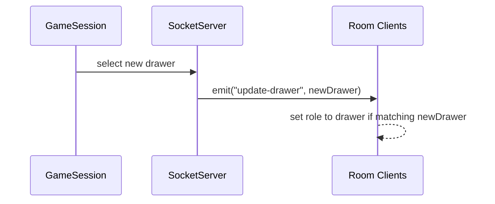
Sequence Diagram 8

#9 **Drawer Undoes a Drawing Stroke**

Precondition
The canvas has at least one saved drawing state in the undoHistory array, and the current user is in the drawer role.

When the drawer clicks the Undo button, the undo_action() function fires. It checks that there’s at least one save state. It then pops the last ImageData savestate from undoHistory, re-renders the canvas with context.putImageData() and emits a "canvasUndo" event  to inform the other clients of the undo action.

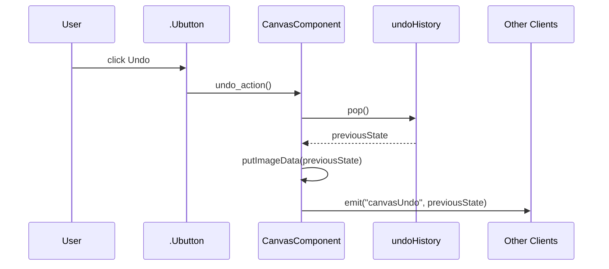
Sequence Diagram 9

#10 **Drawer Clears the Drawing Board**

Precondition
The user is in the drawer role.

When the drawer clicks the Clear button, the canvas is reset to its blank background.

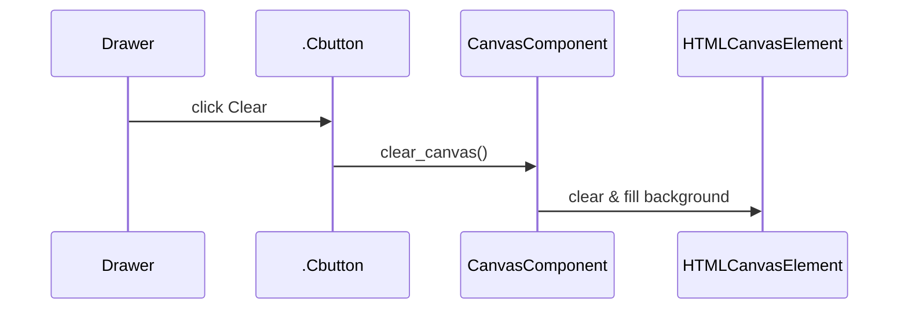
Sequence Diagram 10

#11 **Drawer Changes Stroke Color**

Precondition
The user is in the drawer role.

When the drawer clicks a color swatch, the component updates the draw_color value to the selected color.

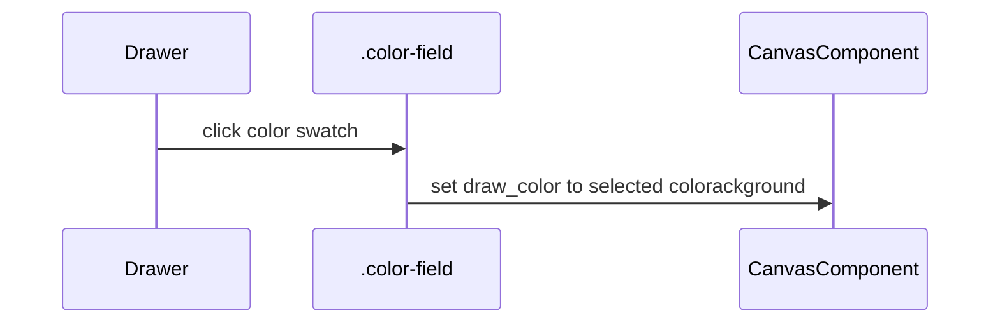
Sequence Diagram 11

#12 **Drawer Changes Stroke Width**

Precondition
The user is in the drawer role.

When the drawer adjusts the stroke width slider, the component updates the draw_width value to the slider’s current value.

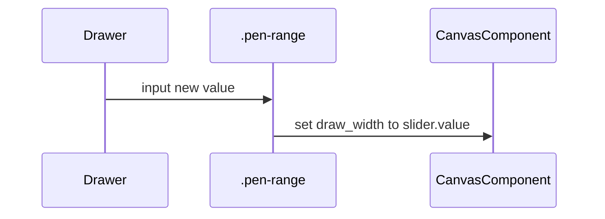
Sequence Diagram 12


#### 13. aacBoard
The aacBoard is a communication tool for users with special needs. It allows users to select items and categories, and it provides a text-to-speech function to speak the selected item.

#### 14. DrawingBoard
The DrawingBoard provides the functionality for users to draw on a canvas. It includes methods for starting, drawing, and stopping the drawing process, as well as undoing and clearing the canvas.

#### 15. WaitingRoom
WaitingRoom is the lobby area before the game starts. It provides the functionality for players to wait, view the game’s shape images, and either start or leave the game.

#### 16. GuessBoard
The GuessBoard is the section where players can make guesses during the game. It manages the current round, time, and player data, and communicates with the game state.

#### 17. EndGameScreen
EndGameScreen shows the final results after the game ends. It provides options to play again or leave the game and checks if a player has achieved a high score.

#### 18. HostLobbyView
HostLobbyView allows the host to manage game settings such as the number of players, round count, and avatar selection. The host can also start the game from here.

#### 19. JoinLobbyView
JoinLobbyView is for players joining an existing lobby. It allows players to select their avatar and shape, and it provides the option to join the game.

#### 20. HomeViewContent
HomeViewContent contains the content displayed on the home page. It handles user interaction, such as clicking on text to navigate to different routes.

#### 21. SpeechSynthesis
SpeechSynthesis is used to convert text to speech, providing accessibility features like TTS for the application.

----
### Backend (Server-Side) Socket.io/Express/Node:

#### 22. Server
The Server class manages the server initialization, starting the server, and handling server requests. It is responsible for hosting the game.

#### 23. SocketServerHandler
SocketServerHandler listens for socket events and manages communication between the server and clients. It handles setting up the server, client connection, and managing game data over WebSockets.

#### 24. SocketServer
SocketServer is responsible for managing the socket server instance and handling communication with clients.

#### 25. ExpressApp
ExpressApp is responsible for setting up the Express application, typically used for building REST APIs in Node.js.

#### 26. HttpServer
HttpServer is used for handling HTTP requests, typically through the Express application, to interact with clients.

#### 27. GameData
GameData manages the data specific to the game session, such as player data, game rounds, prompts, and timer. It includes methods for updating the game state, starting new rounds, and checking if all guesses are correct.

---

## Class Diagram

```mermaid
classDiagram
   class Main {
       +createApp(App)
       +use(Pinia)
       +use(Router)
       +mount()
   }
   class Pinia {
   }
   class App {
       +RouterView
       +SettingState
       +SettingsOverlay
   }
   class defineStore {
   }
   class RouterLink {
   }
   class RouterView {
   }
   class SettingState {
       -showSettings: boolean
       -enableTTS: boolean
       -pathToTTSimg: string
       -backgroundOpacity: number


       +setModeTTS(enableTTS: boolean) void
       +setVolumeTTS(newVolume: number) void
       +setBackgroundOpacity(value: number) void
       +toggleSettings() void
   }
   class GameState{
       +setGameState(user: string, avatar: string, code: number, isHost: boolean, maxPlayers: number, rounds: number, isHostPlaying: boolean)
   }
   class SettingsOverlay {
       +toggleTTS() void
       +updateVolume(e) void
       +updateOpacity(e) void
       +close() void
   }
   class Router {
       +HomeView
       +GameView
       +HostLobbyView
       +JoinLobbyView
   }
   class SpeechHelper{
      +speakNow(textToSpeak: string, settinsState: boolean) void
   }
   class HomeView {
       +HomeViewContent
   }
   class GameView {
       +triggerAllGuessedCorrectPopup() void
       +triggerTimeRanOutPopup() void
       +speakRoomCode() void
       +getShapeImage(digit: number) string
       +getShapeLabel(digit: number) string
       +serverConnect() void
       +serverDisconnect() void
       +handleItemSelected(item: string, imagePath: string) void
       +sendDrawDataInit(x: number, y: number, draw_color: string, draw_width: number) void
       +sendDrawData(x: number, y: number) void
       +sendDrawDataEnd() void
       +sendDrawDataClear() void
       +sendDrawDataUndo() void
       +sendTimerStart(length: number) void
       +startGame() void
       +playAgain() void
       +leaveLobby() void
       -roomCodeArr: number
       -currentUserMessage: object
       -showTimeRanOutPopup: boolean
       -showAllGuessedCorrectPopup: boolean
       -playerScore: number
       -settingState: boolean
       -selectedImagePath: string
       -currentUser: string
       -currentUserAvatar: string
       -currentUserMessage: string
       -currentDrawer: string
       -isGuessCorrect: boolean
       -messageBoard: object[]
       -mappedPlayerData: Map
       -isDrawer: boolean
       -isHost: boolean
       -isHostPlaying: boolean
       -promptWord: string
       -promptImgPath: string
       -context: canvas
       -numRounds: number
       -currentRound: number
       -maxPlayers: number
       -players: string[]
       -roundTimer: number
       -roomCodeArr: number[]
       -roomCodeStr: string
       -gameStarted: boolean
       -gameEnded: boolean
       -AACboardDisabled: boolean
       -AACboardDisabledDuration: number
       -AACboardDisableTimer: number
       -AACButtons:
       -roomCodeShapes:
   }
   class SocketClientHandler{
      +connectSocketServer(socketServer: string, testServer: string, inProduction: boolean, gameData: object) Socket
      +initSocketConnection(socketServer: string, testServer: string, inProduction: boolean) void
      +reateLobby(socket: object, gameData: object) void
      +initSocketListeners(socket: object, gameData: object) void
   }
   class aacBoard {
       +selectItem(item: string) void
       +setCurrentCategory(category: string|null) void
       +getCategoryImage(category: string) string
       +getItemImage(category: string, item: string) string


       -currentCategory: string
       -categories: object
       -categoryList: string[]
       -settingsState: SettingState
       -emit: function
       -props: [ disabled: boolean, timeDisabled: number ]
   }
   class DrawingBoard {
       +clear_canvas() void
       +undo_action() void
       +saveState() void
       +start(event: Event) void
       +draw(event: Event) void
       +stop(event: Event) void
       +calculateDrawCoords(event: Event) ( x: number, y: number )
      
       -canvasRef: HTMLElement|null
       -context: CanvasRenderingContext2D|null
       -undoHistory: any[]
       -draw_color: string
       -is_drawing: boolean
       -draw_width: number
       -start_background_color: string
       -props: [ isDrawer: boolean ]
   }
   class WaitingRoom {
       +speakRoomCode() void
       +getShapeImg(digit: number) string
       +showNotEnoughPlayersAlert() void
       +startGame() void
       +leaveLobby() void


       -props: [ roomCode: string[], maxPlayers: number, players: string[], numRounds: number, isHost: boolean, isHostPlaying: boolean ]
       -settingsState: object
       -shapes: [ value: number, imgSrc: string, shape: string ]
   }


   class GuessBoard {
       -props: [
           playerDataMap: Map<String, [ score: number, currentGuess: string, currentGuessImagePath: string ]>,
           time: number,
           currentRound: number,
           totalRounds: number,
           roomCodeArr: number[],
           getShapeImage: function,
           getShapeLabel: function,
           speakRoomCode: function,
           currentDrawer: string
       ]
   }


   class EndGameScreen {
       +playAgain() void
       +leaveLobby() void
       +hasHighscore(score: number) bool
       -props: [
           isHost: boolean,
           playerDataMap: Map<String, [ score: number ]>
       ]
   }


   class HostLobbyView {
       +validatePlayerCount() void
       +validateRoundCount() void
       +toggleAvatars(show: boolean) void
       +selectAvatar(button) void
       +launchRoom() void
       -userGameState: GameState
       -settingsState: SettingState
       -maxPlayers: number
       -rounds: number
       -randomCodeDigits: number[]
       -currentUser: string
       -currentUserAvatar: string
       -showAvatars: boolean
       -isHostPlaying: boolean
       -randomCodeString: string
       -avatarButtons: string
   }
   class JoinLobbyView {
       +showNoAvatarSelectedAlert() void
       +selectShape(shape) void
       +undoShape() void
       +clearShapes() void
       +selectAvatar(button) void
       +joinLobby() void
       -userGameState: GameState
       -settingsState: SettingState
       -selectedShapes: string[]|null
       -shapes: string[]
       -roomCodeArr: number[]
       -currentUser: string
       -currentUserAvatar: string
       -avatarButtons: string[]
   }
   class HomeViewContent {
       +handleClick(text: string, route: string) void
   }
   class SpeechSynthesis {
   }


   Main --> App : uses
   Main --> Router : uses
   Main --> Pinia : uses

   App --> RouterView : uses
   App --> SettingState : uses
   App --> SettingsOverlay : uses

   SettingsOverlay --> SettingState : uses
   SettingsOverlay --> SpeechHelper: uses

   SettingState --|> defineStore : based on
   GameState --|> defineState: based on

   RouterView --> Router : depends on
   RouterLink --> RouterView : depends on

   Router --> HomeView : route to
   Router --> GameView : route to
   Router --> HostLobbyView : route to
   Router --> JoinLobbyView : route to

   HomeView --> HomeViewContent : uses

   HomeViewContent --> SettingState : uses
   HomeViewContent --> Router : navigates with
   HomeViewContent --> SpeechSynthesis : uses
   HomwViewContent --> SpeechHelper: uses

   HostLobbyView --> GameState : uses
   HostLobbyView --> SettingState : uses
   HostLobbyView --> SpeechSynthesis : uses
   HostLobbyView --> RouterLink : navigates with
   HostLobbyView --> SpeechHelper: uses

   JoinLobbyView --> GameState : uses
   JoinLobbyView --> SettingState : uses
   JoinLobbyView --> SpeechSynthesis : uses
   JoinLobbyView --> RouterLink : navigates with
   JoinLobbyView --> SpeechHelper: uses

   GameView --> aacBoard : uses
   GameView --> DrawingBoard : uses
   GameView --> WaitingRoom : uses
   GameView --> GuessBoard : uses
   GameView --> EndGameScreen : uses
   GameView --> GameState : uses
   GameView --> SettingState : uses
   GameView --> SocketClientHandler : uses
   GameView --> SpeechHelper: uses

   aacBoard --> SettingState : uses
   aacBoard --> SpeechHelper: uses
   
   DrawingBoard --> SettingState : uses
   DrawingBoard --> SpeechHelper: uses

   WaitingRoom --> SettingState : uses
   WaitingRoom --> RouterLink : uses
   WaitingRoom --> SpeechHelper: uses

   GuessBoard --> SettingState : uses
   GuessBoard --> SpeechHelper: uses

   EndGameScreen --> SettingState : uses
   EndGameScreen --> Router : uses
   EndGameScreen --> SpeechHelper: uses


class Server {
       +initialize() void
       +startServer() void
   }


   class SocketServerHandler {
       +initializeServerListeners(io: SocketIO.Server, socket: SocketIO.Socket, mappedGameData: Map) void
       +startServer(server: http.Server, port: number) void
   }


   class SocketServer {
   }


   class ExpressApp {
   }


   class HttpServer {
   }


   class SocketServerHandler {
       +createServerInstance(httpServer: http.Server) SocketIO.Server
       +startServer(httpServer: http.Server, port: number) void
       +initializeServerListeners(server: SocketIO.Server, client: SocketIO.Socket, gameDataMap: Map) void
   }


    class GameData {
       +numberRounds
       +currentRound
       +maxPlayers
       +players
       +prompt
       +drawer
       +timerID
       +timerValue
       +playerData
       +startNewRound(server, room, gameDataMap)
       +getPromptObject()
       +getPath(promptObject)
       +clearGuesses(server, room)
       +allGuessesCorrect()
       +updateTimer(server, room, gameDataMap)
   }

   ExpressApp --> Server : uses
   HttpServer --> Server : uses
   SocketServerHandler --> Server : listens to socket events
   SocketServer --> SocketServerHandler : manages server instance
   SocketServerHandler --> MappedGameData : manages game state
   SocketServerHandler --> GameData : uses
   SocketServerHandler --> SocketIO.Server : creates
   SocketServerHandler --> SocketIO.Socket : listens to
   SocketServerHandler --> gameDataMap : uses


   GameView --> Server : sends requests to
   Server --> GameView : sends responses or emits events
```

## Sequence Diagrams

#1 **Non-Playing User Hosts a Game Lobby**
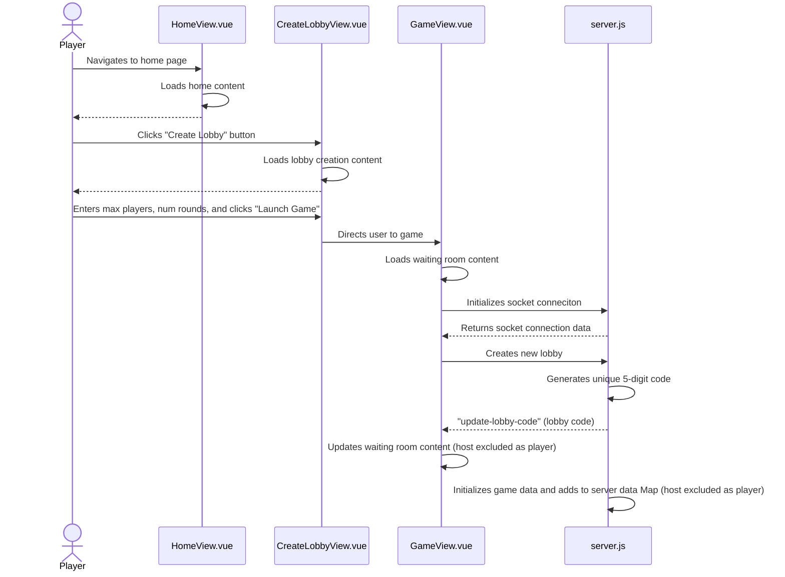

After navigating to the home screen, the user clicks the "Create Lobby" button. This loads the CreateLobbyView.vue component. Next, the user specifies the maximum number of players (2–8) in the "Max Players" field and the number of rounds in the "Number of Rounds" field. Finally, the user clicks the "Launch Room" button, triggering the loading of the GameView component. On mount, socket connection is initialized, a unique 5-digit room code is generated and sent to the host, and game data on the back-end is initialized, excluding the host as a player.

#2 **Playing User Hosts a Game Lobby**
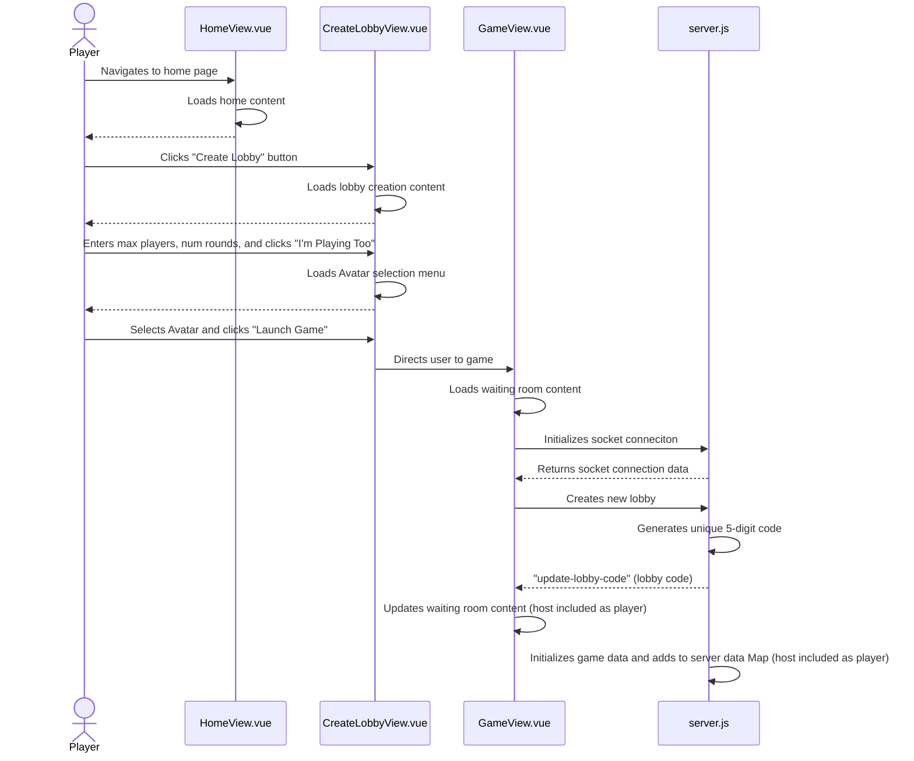

After navigating to the home screen, the user clicks the "Create Lobby" button. This loads the CreateLobbyView.vue component. Next, the user specifies the maximum number of players (2–8) in the "Max Players" field and the number of rounds in the "Number of Rounds" field. Next, the user clicks the "I'm playing too" button and selects and Avatar from the player list. Finally, the user clicks the "Launch Room" button, triggering the loading of the GameView component. On mount, socket connection is initialized, a unique 5-digit room code is generated and sent to the host, and game data on the back-end is initialized, including the host as a player.

#3 **User Joins an Existing Game Lobby**
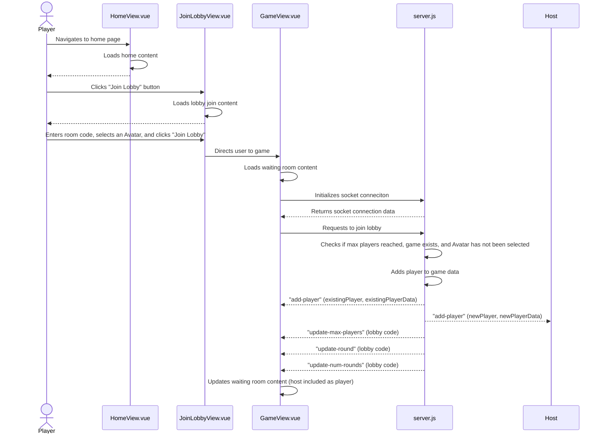

After being provided a valid room code, a new user is ready to attempt to join the lobby. From the home screen, the user clicks the "Join Lobby" button. This loads the JoinLobbyView.vue component. Next, the user enters the provided room code in the form of shapes and selects an Avatar from the Avatar selection menu. Finally, the user clicks the "Join Lobby", triggering the loading of the GameView component. On mount, socket connection is initialized, the server verifies there are no duplicate Avatars, the lobby exists, and max players hasn't been reached. Next, the server updates all users of a new player added to the game and updates the new player with each player already in the lobby, max players, current rounds, and number of rounds to be played.

#4 **User Attempts to Join a Non-Existing Lobby**
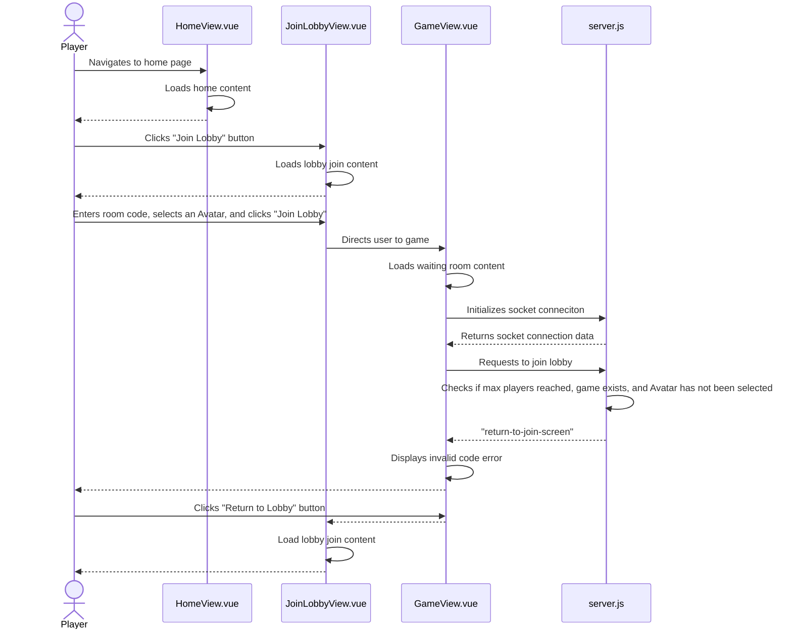
After being provided an invalid room code, a new user is ready to attempt to join the lobby. From the home screen, the user clicks the "Join Lobby" button. This loads the JoinLobbyView.vue component. Next, the user enters the provided room code in the form of shapes and selects an Avatar from the Avatar selection menu. Finally, the user clicks the "Join Lobby", triggering the loading of the GameView component. On mount, socket connection is initialized, the server fails verification of an existing server and emits an request to return to join lobby screen. This will let the user leave the lobby once the error message is dismissed.

#5 **Hosting User Starts a Game**
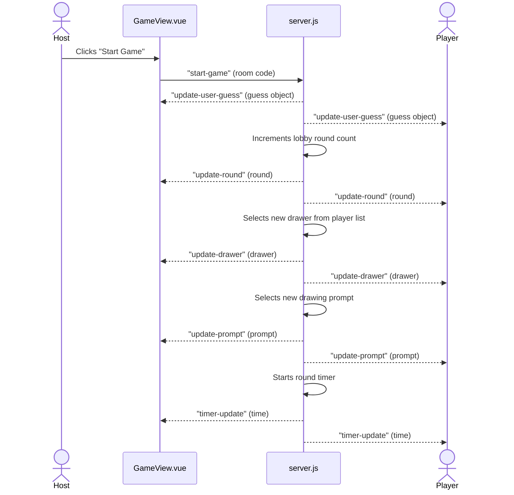

After a lobby has been created and at least two players have joined the lobby, the host presses the "Start Game" button to initiate a new game. A request to start the game is sent to the server. All guesses are cleared and sent to all users in the lobby. A new drawer is selected and sent to all users in the lobby. A new prompt is selected and sent to all users in the lobby. The timer is initialized and broadcasts a timer update every second.

#6 **User is Presented with a Drawing Prompt**

Precondition: Game has started, and it's the user's turn to draw.

When it becomes a user's turn to draw, server.js sends that user an "update-drawer" as well as an "update-prompt" websocket message to the drawer. The user is on the frontend file gameView.vue, and the frontend renders the drawing prompt on the screen for them to see.
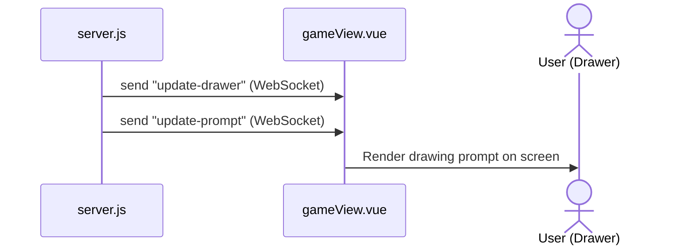
Sequence Diagram 7

#7 **User is Assigned to Draw on the Drawing Board**

#8 **Drawer Undoes a Drawing Stroke**

#9 **Drawer Clears the Drawing Board**

#10 **Drawer Changes Stroke Color**

#11 **Drawer Changes Stroke Width**

#12 **User is Assigned the Role of Guesser**

Precondition: A drawing round if in progress.

Server.js updates the current drawer with a "update-drawer" websocket message after randomly selecting a new drawer at the start of a round. The message data contains which player is the drawer. All users in the room receive the websocket message at the frontend file GameView.vue which checks if they were assigned to be the drawer. If not, they become a guesser. The players do this by storing the drawer in a variable drawer and check if it referrs to themself.

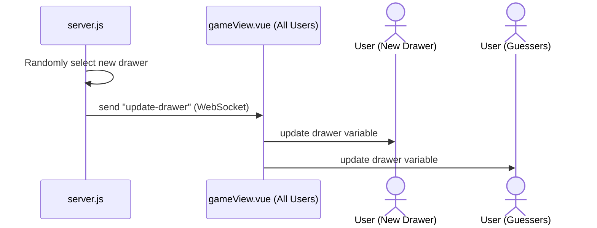
Sequence Diagram 13

#13 **Guesser Selects an Incorrect Guess**

Precondition: User is viewing the AAC board during a around as a guesser.

The user selects a word on the AAC board, and the guess is displayed on the guess board along with the symbol. The user experiences a 5 second cooldown that locks the AAC board temporarily after guessing. This guess word is also sent through a websocket message "update-user-guess" from gameView.vue to server.js. Server.js sends out the guess to all other players with another "update-user-guess" message. Those players also see the guess appear on the guessboard beside the guesser's avatar.

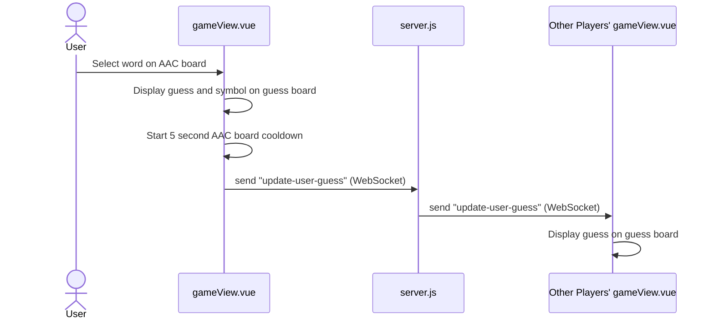
Sequence Diagram 14

#14 **Guesser Selects a Correct Guess**

#15 **All Guessers Guess Correctly**

#16 **Round Timer Ends Before All Guessers Guess Correctly**

Preconditons: A drawing round is in progress.

The backend (GameData.js) detects that the round's timer has expired and emits a timer-ran-out event through the SocketServer. The frontend (SocketClientHandler.js) catches this event and triggers the triggerTimeRanOutPopup() function in GameView.vue. This sets the showTimeRanOutPopup flag to true, causing a "Time Ran Out!" popup to appear on the screen for the player. The popup automatically disappears after 4 seconds.

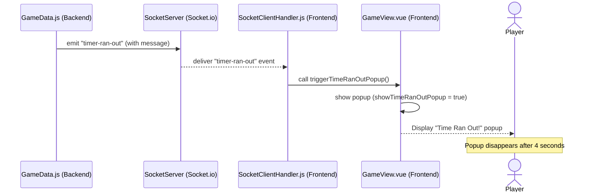

#17 **Game Ends (Regular Player)**

Precondtion: The maximum number of rounds is reached.

When all rounds are completed, GameData.js (backend) emits an end-game event via SocketServer. On the frontend, SocketClientHandler.js receives the event and updates the gameEnded and gameStarted flags inside GameView.vue. This triggers GameView.vue to render the EndGameScreen.vue component. The non-host player is shown a leaderboard displaying the final scores, along with a "Leave Lobby" button (but not a "Play Again" button, since they are not the host).

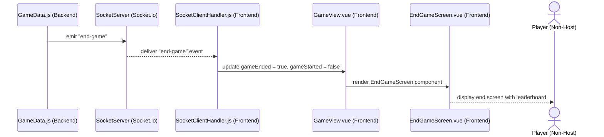

#18 **Game Ends (Host)**

Preconditions: The maximum number of rounds is reached.

After the final round, the backend (GameData.js) sends an end-game event through the SocketServer. The frontend (SocketClientHandler.js) processes the event by setting gameEnded to true and gameStarted to false in GameView.vue. This causes the host to see the EndGameScreen.vue component, similar to non-hosts, but with two additional buttons: "Play Again" and "Leave Lobby", giving the host special control over restarting the game.

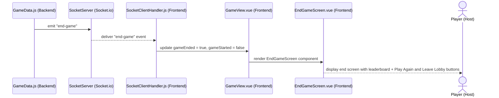

#19 **Users Choose to Play Again After Game Ends**

Preconditons: Game session has ended, and players are on the endgame screen.

When the host clicks the "Play Again" button on the EndScreen.vue, it emits a playAgain event to GameView.vue. GameView.vue then emits two WebSocket messages to the SocketServer: one to reset-scores and another to play-again (sending the room code along). The server broadcasts both messages to all players. The frontend clients (SocketClientHandler.js) listen for these events, resetting all player scores to 0 and setting gameStarted = false and gameEnded = false. After this, GameView.vue displays the WaitingRoom.vue component again, allowing all players, including the host, to wait for the next game to start.

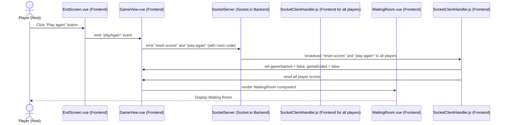

------------------------------------------------OLD DIAGRAMS ARE BELOW------------------------------------------------------

#1 **Host hosts game**  

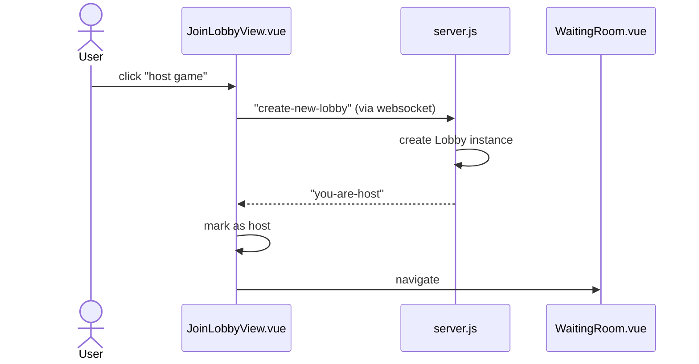
Sequence Diagram 1

The player setting up the game navigates to the host lobby screen. Upon arrival, they see a large "Host Game" Button. This triggers the creation of a lobby with a room code that the host can share to the other players.

The host navigates to the website's host lobby screen (JoinLobbyView.vue), and after configuring the lobby settings, they click the large "host game" button. This triggers a "create-new-lobby" websocket message to server.js to create a new lobby instance. Server.js also sends a "you-are-host" websocket message back to JoinLobbyView.vue informing the frontend's stored memory that the user is host. Then the user is navigated to WaitingRoom.vue.

Triggering Event:
Host navigates to the game website and clicks a button "Host Game".

#2 **Host gets room code**  

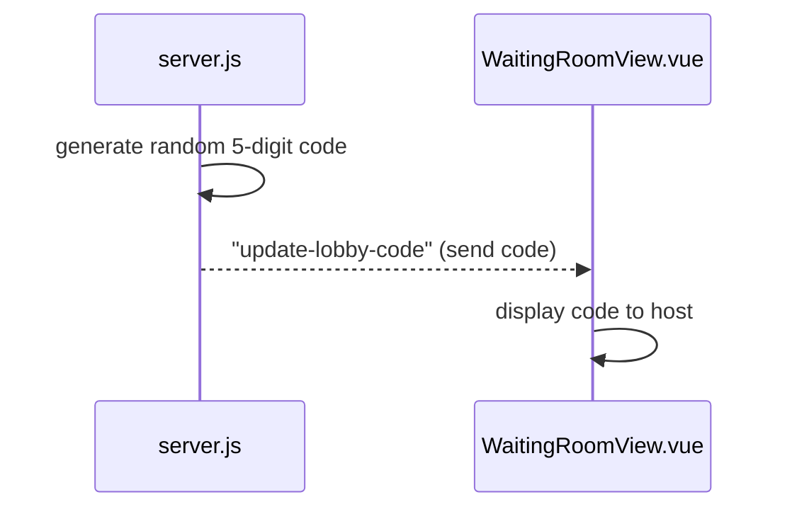
Sequence Diagram 2

The host is presented with a short room code that they will tell the players so they can enter it and join.

Once the new lobby is created in server.js, server.js generates a random 5 digit code and sends taht code over a websocket message "update-lobby-code" to the host. The host receives the code in the WaitingRoomView.vue and can then view the code and share it with others.

Triggering Event: The host has created a lobby by pressing "Host Game".


#3 **Host presses start game button**  

```mermaid
sequenceDiagram
actor player

actor host

host ->> lobby.js: presses start game
activate lobby.js
lobby.js ->> backend.js: start game (websocket)
backend.js ->> lobby.js: to all fontends: start game (websocket)
lobby.js ->> drawing.js: navigate to


```
Sequence Diagram 3: one diagram showing the possibility of drawing.
```mermaid
sequenceDiagram
actor player

actor host

host ->> lobby.js: presses start game
activate lobby.js
lobby.js ->> backend.js: start game (websocket)
backend.js ->> lobby.js: to all frontends: start game (websocket)
lobby.js ->> guessing.js: navigate to
```
Sequence Diagram 4: alternative diagram showing the possibility of guessing.

Once everyone has joined, the host will choose to press the "start game button". This will send a websocket message to the backend, which will be echoed back to all frontends. Then all frontends will navigate to either drawing.js or guessing.js depending on their role for the first round.

Triggering Event: All players have joined the lobby, and the host wants to start the game.

#4 **Players enter room code**  
```mermaid
sequenceDiagram

actor player

player ->> landingPage.js: enters room code

activate landingPage.js
landingPage.js ->> backend.js: checks room code
backend.js -->> landingPage.js: validates room code
landingPage.js ->> lobby.js: navigates to
deactivate landingPage.js
lobby.js ->> player: player sees lobby screen


```
Sequence Diagram 5

Players use the room code provided by the host to enter it and join the lobby. Once entered, the landingPage.js sends the code to the backend for verification, and returns whether it's a valid code or not. If it is valid, it will navigate the user to the appropriate lobby, lobby.js. Then the user will see the lobby screen. 

Triggering Event: The host receives the room code and shares it with other players.

#5 **Players select avatar**  

```mermaid
sequenceDiagram

actor player
landingPage.js ->> backend.js: fetch available avatars (websocket)
backend.js -->> landingPage.js: return available avatars (websocket)
landingPage.js ->> player: display possible avatars
player ->> landingPage.js: select avatar
landingPage.js ->> backend.js: update available avatars (websocket)
backend.js -->> landingPage.js: confirm update (websocket)
landingPage.js ->> lobby.js: navigates to
lobby.js ->> player: shows avatar in lobby screen

```
Sequence Diagram 6

Upon joining, each player will be presented with an array of avatars to choose from, and they must tap an avatar to join the lobby with that avatar. First, the frontend must fetch the available avatars from the backend as a websocket message. The backend returns the available avatars, and the landingPage displays them to the user for selection. The user will make a selection, and landingPage.js will update the avatar list in the backend, which will verify with a return value. Then the landingPage.js will navigate to lobby.js where the user will see the lobby along with their avatar.

Triggering Event: A user has entered a valid room code.

#6 **One player is selected at random to be a drawer**  

```mermaid
sequenceDiagram

actor player
participant drawing.js
participant lobby.js
participant backend.js

backend.js ->> backend.js: randomly selects drawer
backend.js ->> lobby.js: start game websocket message (contains role info)
lobby.js ->> drawing.js: navigates to
drawing.js ->> player: player sees drawing page

```
Sequence Diagram 7: showing the possibility of drawing first.
```mermaid
sequenceDiagram

actor player
participant guessing.js
participant lobby.js
participant backend.js

backend.js ->> backend.js: randomly selects drawer
backend.js ->> lobby.js: start game websocket message (contains role info)
lobby.js ->> guessing.js: navigates to
guessing.js ->> player: player sees guessing page

```
Sequence Diagram 8: alternative showing the possibility of guessing first.

Out of all players, including the host, one is randomly selected to be the first drawer. They will be shown the drawing interface. First, the backend randomly select a drawer from the list of players. Next, it will send a start game websocket message containing role info. Each player's lobby.js will take that information and either navigate them to guessing.js or drawing.js, where the users will see the appropriate UI.

Triggering Event: The host pressed start game.

#7 **The drawer is given 3 random choices to choose from to draw**  

```mermaid
sequenceDiagram

actor drawer
participant drawing.js
backend.js ->> backend.js: selects 3 random prompts from list
backend.js ->> drawing.js: prompt choices (websocket)
drawing.js ->> drawer: drawer sees prompt choices
drawer ->> drawing.js: selects prompt
drawing.js ->> backend.js: current prompt (websocket)

```
Sequence Diagram 9

The drawer is provided with 3 random prompts on their screen as buttons to choose from to draw. They tap on the choice that they want, and then they can begin drawing. First, the backend must randomly select 3 prompts from the list of possible prompts. The backend relays these choices in a websocket message to the drawing.js frontend file. the drawer sees the list, makes a choice, and drawing.js relays the choice to the backend.

Triggering Event: The drawer has been randomly selected.

#8 **Guessers see a guessing interface and drawing as it progresses**  

```mermaid
sequenceDiagram

actor guesser
actor drawer
participant guessing.js
participant drawing.js
participant backend.js

drawer ->> drawing.js: draws on the interface
drawing.js ->> backend.js: frequent drawing information (websocket)
backend.js ->> guessing.js: frequent drawing information (websocket)
guessing.js ->> guesser: guesser spectates drawing
guesser ->> guessing.js: guesser makes a guess
guessing.js ->> backend.js: guess information (websocket)
backend.js ->> backend.js: checks guess
backend.js -->> guessing.js: guess response (websocket)

```
Sequence Diagram 10

Default flow: The guessers spectate the drawing and make guesses using the AAC tablet as the round progresses.  
Alternative flow: The guessers spectate the drawing and make guesses using the keyboard after clicking the keyboard toggle button.  
There is a timer counting down during each drawing phase. 

Further explanation: First, the drawer begins drawing on the interface on drawing.js, and frequent websocket information containing drawing data is sent to the backend. The drawing data is echoed to all guessing.js frontends that are spectating. Guessers spectate and enter guesses, which are relayed from guessing.js to backend.js to be checked. The user sees the result of their guess when another websocket message comes back from the backend to guessing.js.

Triggering Event: The drawer has selected one of the three random drawing prompts.  
Alternate Triggering Event: The drawer ran out of time (15s) to choose a prompt and one has been randomly selected.

#9 **Phase ends when the timer expires or everyone has guessed correctly**  

```mermaid
sequenceDiagram

actor drawer
actor guesser
backend.js ->> guessing.js: guessing over (websocket)
backend.js ->> drawing.js: drawing over (websocket)
guessing.js ->> guesser: reveal the prompt
drawing.js ->> drawer: show guessing phase results

```
Sequence Diagram 11

At this point, the correct answer will be displayed, and players will be awarded points. Point award values have not been determined yet. First, the backend messages all guessing frontends and the drawing frontend that the drawing is over along with important information about the round. Then the prompt is revealed to the guessers, and the drawer sees the results of who guessed correctly.  

Triggering Event: drawer draws prompt and players try to guess the drawing prompt.

#10 **Players are awarded points for guessing correctly, drawer is awarded for players guessing the drawing** 
```mermaid
sequenceDiagram
actor guesser
participant guessing.js

guesser ->> guessing.js: enters guess
guessing.js ->> backend.js: guess (websocket)
backend.js ->> backend.js: checks guess
backend.js ->> backend.js: adds points to guesser's score
backend.js -->> guessing.js: correct guess response (websocket)
guessing.js -->> guesser: guesser sees they guessed correct

```
Sequence Diagram 12  

Players will accumulate points based on their performance in the game. When a guesser enters a guess, guessing.js sends the guess in a websocket to the backend where it is checked, points are added to the players score, and the guess response data is sent back to guessing.js for the user to see.

Triggering event: The drawer has begun drawing and one of the guessers wants to make a guess.

#11 **Users see summary screen**  
```mermaid
sequenceDiagram

actor player
participant summary.js
participant backend.js
backend.js ->> backend.js: determines rankings
backend.js ->> summary.js: summary information (websocket)
summary.js ->> player: sees summary screen


```
Sequence Diagram 13  

After everyone draws for their third time, total points will be displayed, and rankings will be shown at the end of the game. The backend will keep track of when the final round ends, and it will determine the rankings and deliver  the summary information to summary.js where users will see a summary screen.  

Triggering Event: All players have drawn three times.

## Algorithms

### 1. Player Selection (Random Drawer)
- Selects one player randomly from the active lobby.
- Uses `Math.random()` to pick an index from the player list.

### 2. Word Selection (Random Prompt Assignment)
- Retrieves three random words from a predefined list.
- Uses Fisher-Yates shuffle or a similar algorithm.
- If no selection in 15s, a word is randomly assigned.

### 3. Guess Matching Algorithm
- Converts guess and answer to lowercase, removes punctuation.
- Awards correct answer points 

### 4. Score Calculation
- Guessers earn points based on time taken.
- Drawer earns points based on correct guesses.
- Balanced scoring to avoid excessive competitiveness.
  

### Collection Schemas
**Users Collection**  
```json
{
  "avatar": "String",
  "room_code": "String"
}
```

#### Collection Schemas
**Guess**  
```json
{
  "guess": "String",
}
```
