## Component Descriptions

### Frontend (Client-Side):

**GameRoom**  
The GameRoom class contains elements that pertain to management of game sessions, including players, game rounds, and prompt information. It is the core game logic and controls the flow of the game such as which players are drawing, which players are guessing, the transitions between rounds, and starting and ending the game. It will handle prompts ensuring that none are repeated, and provides references to images pertaining to the prompts. This class also handles server-side functionality but for organization it is under client-side.

**Player**  
This class is used to represent individual users who will be playing the game. It will store a player’s details and score pertaining to the game session, and 

**DrawingCanvas**  
This class handles drawing functionality such as the canvas to draw on, the tools to draw with, and the stroke/color to draw with. It gathers the data from the drawer so it can be sent to the interfaces of the other players. It will also aid in displaying the reference image to the current drawer and only the drawer. 

**ReferenceImageProvider**  
This will gather any paths to reference images to feed to GameRoom class so it can be displayed to the current drawer. The image paths are selected by the current word for the drawing prompt, and ensures that image selection is randomized each time. 

**ChatMessage**  
The messages or symbols to be sent in chat are handled by this class. It stores a player’s chat history to broadcast it to other player interfaces and also to determine the correct word for a prompt.

**GameSettings**  
This class is used to provide game sessions with rules and configurations such as how much time per round, how many players can join, and if AAC controls are enabled or not.

**AACBoard**  
This class manages AAC board integration from the AsTeRICS Grid REST API. It will fetch and store symbols from a board in the API and allow players to use them in the chat.

**AACSymbol**  
This class is used to represent symbols fetched from the API with information such as an ID and the URL, and then give a label and category. 

### Backend (Server-Side):

**GameSession**  
This class uses the attributes from the GameRoom class and starts the game. GameSession handles the functionality of game session initiation, progression, and termination. It keeps track of current players in session, rounds completed, and then determines the winning player at the end. 

**DataDrawing**  
This class is fed by the GameSession class and records the data from drawings made by an individual user.

**StrokeData**  
The class is used to represent an individual stroke of a drawing, and stores the coordinates, color, and size.

**SocketHandler**  
This class manages WebSocket integration so that players can interact in real-time. It will handle client-server communication such ad connections, disconnections, drawing and chat events, and round starting or stopping.

## Class Diagram


## Sequence Diagrams

#1 **Host hosts game**  

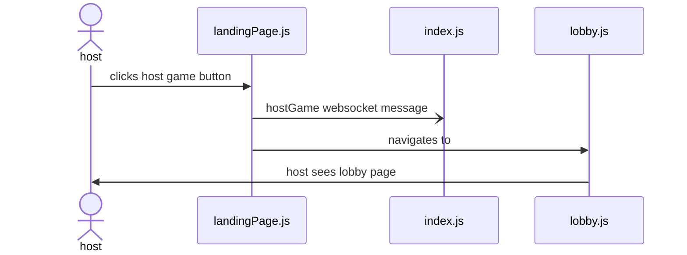
Sequence Diagram 1

The player setting up the game navigates to the website. Upon arrival, they see a large "Host Game" Button. This triggers the creation of a lobby with a room code that the host can share to the other players.

Triggering Event:
Host navigates to the game website and clicks a button "Host Game".

#2 **Host gets room code**  

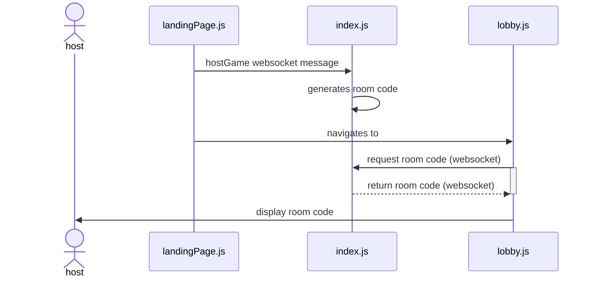
Sequence Diagram 2

The host is presented with a short room code that they will tell the players so they can enter it and join.

Triggering Event: The host has created a lobby by pressing "Host Game".


#3 **Host presses start game button**  

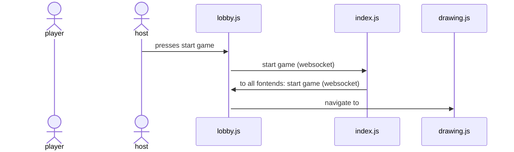
Sequence Diagram 3: one diagram showing the possibility of drawing.
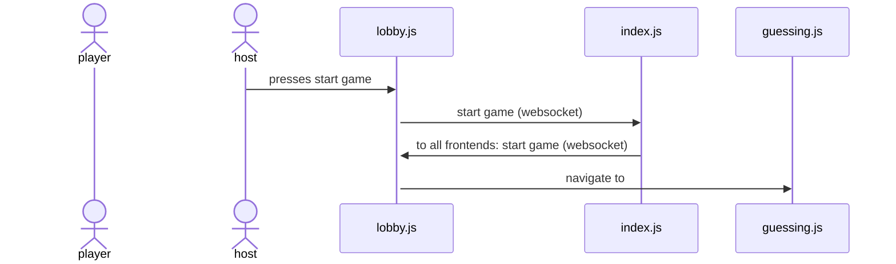
Sequence Diagram 4: alternative diagram showing the possibility of guessing.

Once everyone has joined, the host will press start game. This will trigger the beginning of the game cycle.  

Triggering Event: All players have joined the lobby, and the host wants to start the game.

#4 **Players enter room code**  
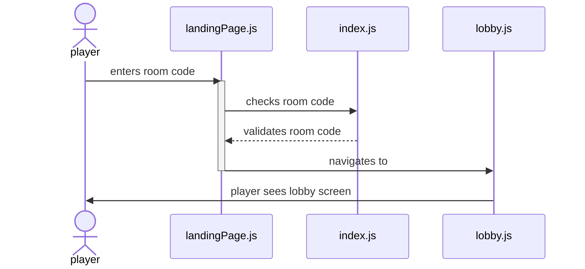
Sequence Diagram 5

Players use the room code provided by the host to enter it and join the lobby. 

Triggering Event: The host receives the room code and shares it with other players.

#5 **Players select avatar**  

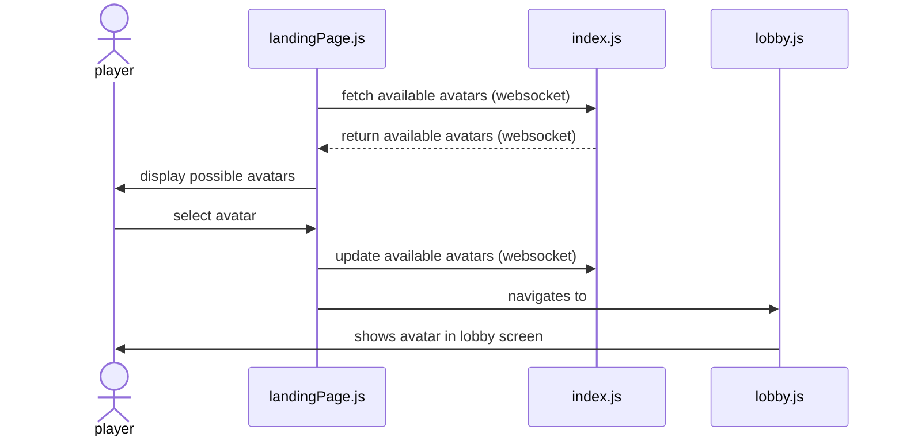
Sequence Diagram 6

Upon joining, each player will be presented with an array of avatars to choose from, and they must tap an avatar to join the lobby with that avatar.  

Triggering Event: A user has entered a valid room code.

#6 **One player is selected at random to be a drawer**  


Sequence Diagram 7: showing the possibility of drawing first.
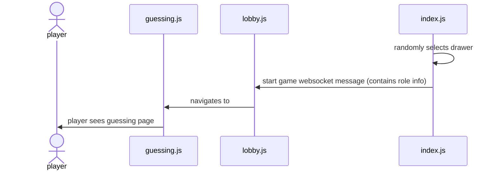
Sequence Diagram 8: alternative showing the possibility of guessing first.

Out of all players, including the host, one is randomly selected to be the first drawer. They will be shown the drawing interface.  

Triggering Event: The host pressed start game.

#7 **The drawer is given 3 random choices to choose from to draw**  

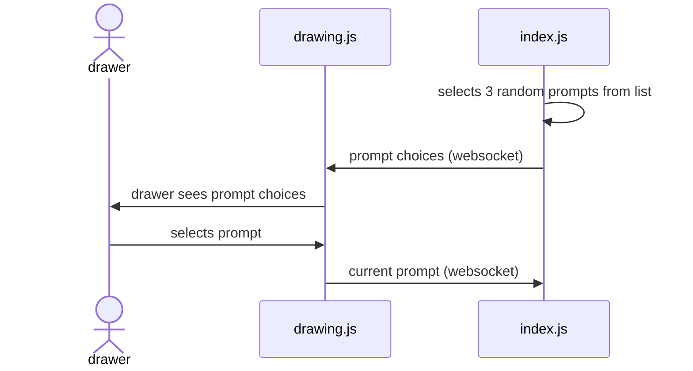
Sequence Diagram 9

The drawer is provided with 3 random prompts on their screen as buttons to choose from to draw. They tap on the choice that they want, and then they can begin drawing.  

Triggering Event: The drawer has been randomly selected.

#8 **Guessers see a guessing interface and drawing as it progresses**  

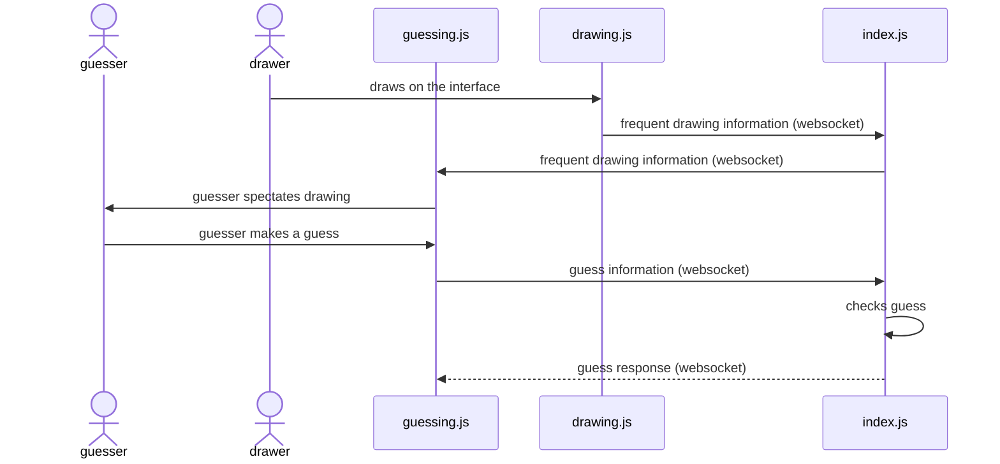
Sequence Diagram 10

Default flow: The guessers spectate the drawing and make guesses using the AAC tablet as the round progresses.  
Alternative flow: The guessers spectate the drawing and make guesses using the keyboard after clicking the keyboard toggle button.  
There is a timer counting down during each drawing phase.  

Triggering Event: The drawer has selected one of the three random drawing prompts.  
Alternate Triggering Event: The drawer ran out of time (15s) to choose a prompt and one has been randomly selected.

#9 **Phase ends when the timer expires or everyone has guessed correctly**  

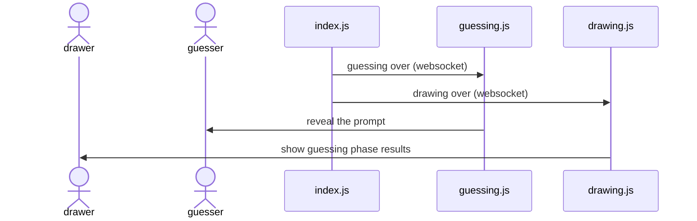
Sequence Diagram 11

At this point, the correct answer will be displayed, and players will be awarded points. Point award values have not been determined yet.  

Triggering Event: drawer draws prompt and players try to guess the drawing prompt.

#10 **Players are awarded points for guessing correctly, drawer is awarded for players guessing the drawing** 
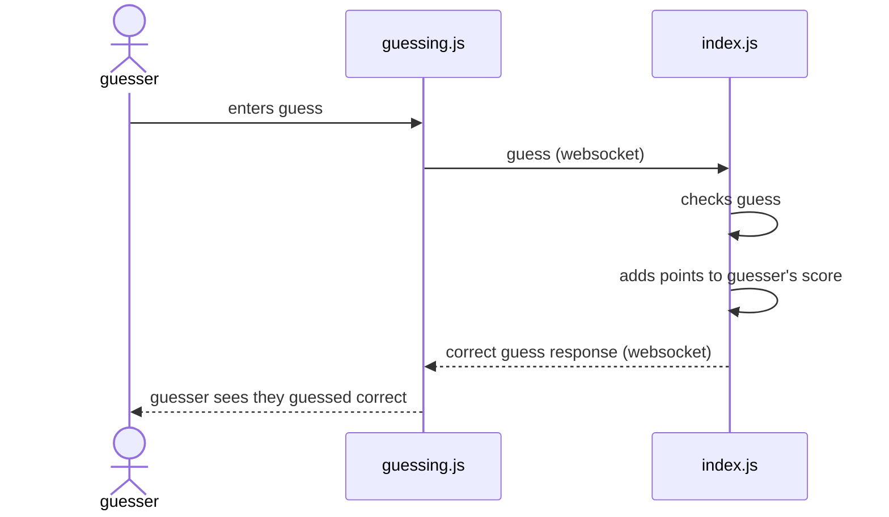
Sequence Diagram 12  

Players will accumulate points based on their performance in the game, but we want to make sure that the game doesn't feel too competitive.  

#11 **Users see summary screen**  

Sequence Diagram 13  

After everyone draws for their third time, total points will be displayed, and rankings will be shown at the end of the game.  
Triggering Event: All players have drawn three times.

## Algorithms

### 1. Player Selection (Random Drawer)
- Selects one player randomly from the active lobby.
- Uses `Math.random()` to pick an index from the player list.

### 2. Word Selection (Random Prompt Assignment)
- Retrieves three random words from a predefined list.
- Uses Fisher-Yates shuffle or a similar algorithm.
- If no selection in 15s, a word is randomly assigned.

### 3. Guess Matching Algorithm
- Converts guess and answer to lowercase, removes punctuation.
- Awards correct answer points 

### 4. Score Calculation
- Guessers earn points based on time taken.
- Drawer earns points based on correct guesses.
- Balanced scoring to avoid excessive competitiveness.
  

### Collection Schemas
**Users Collection**  
```json
{
  "avatar": "String",
  "room_code": "String"
}
```

#### Collection Schemas
**Guess**  
```json
{
  "guess": "String",
}
```

