## Component Descriptions
---

### Frontend (Client-Side) Vue/Socket.io-Client/Pinia:

#### 1. Main
The Main class is responsible for initializing and setting up the core functionality of the application. It creates the App instance, integrates the Pinia state management, and sets up the Router to handle routing between views. It also mounts the application to the DOM.

#### 2. Pinia
Pinia is a state management system used to store and manage the application's state. It works similarly to Vuex but is a more modern and simplified alternative for state management in Vue.js applications.

#### 3. App
The App class serves as the root of the application. It contains important child components such as RouterView, which handles the routing of views, SettingState, which holds the application's settings, and SettingsOverlay, which provides a UI for overlay settings adjustments.

#### 4. defineStore
defineStore is used for defining stores in the Pinia state management system. A store holds the state and actions used to manage it across different components in the application.

#### 5. RouterLink
RouterLink is a component used to create links between different routes in the application. It allows navigation from one view to another when clicked.

#### 6. RouterView
RouterView is a placeholder component that renders the view corresponding to the current route. It is part of the Vue Router, which handles navigation between different components/views in the app.

#### 7. SettingState
The SettingState class holds various user settings such as whether text-to-speech (TTS) is enabled, the opacity of the background, and the path to TTS images. It also includes methods to modify these settings, such as adjusting TTS volume or background opacity, and toggling the settings overlay.

#### 8. GameState
GameState manages the state of the game, such as player data (e.g., user, avatar, room code), game rules (e.g., rounds, max players), and the game’s progression (e.g., host status, game state).

#### 9. SettingsOverlay
The SettingsOverlay class provides a UI overlay for adjusting game settings like TTS. It allows the user to change settings and control the volume and opacity of TTS. It also includes functionality for text-to-speech conversion.

#### 10. Router
Router handles the routing between different views in the application. It defines routes to the HomeView, GameView, HostLobbyView, and JoinLobbyView components, each corresponding to different parts of the app.

#### 11. HomeView
HomeView is the main entry point or home page of the application. It displays initial content and provides navigation to other views.

#### 12. GameView
GameView is the main game interface, where players interact with each other. It includes methods for triggering popups, handling game mechanics (e.g., drawing, guessing), and communicating with the server.

#### 13. aacBoard
The aacBoard is a communication tool for users with special needs. It allows users to select items and categories, and it provides a text-to-speech function to speak the selected item.

#### 14. DrawingBoard
The DrawingBoard provides the functionality for users to draw on a canvas. It includes methods for starting, drawing, and stopping the drawing process, as well as undoing and clearing the canvas.

#### 15. WaitingRoom
WaitingRoom is the lobby area before the game starts. It provides the functionality for players to wait, view the game’s shape images, and either start or leave the game.

#### 16. GuessBoard
The GuessBoard is the section where players can make guesses during the game. It manages the current round, time, and player data, and communicates with the game state.

#### 17. EndGameScreen
EndGameScreen shows the final results after the game ends. It provides options to play again or leave the game and checks if a player has achieved a high score.

#### 18. HostLobbyView
HostLobbyView allows the host to manage game settings such as the number of players, round count, and avatar selection. The host can also start the game from here.

#### 19. JoinLobbyView
JoinLobbyView is for players joining an existing lobby. It allows players to select their avatar and shape, and it provides the option to join the game.

#### 20. HomeViewContent
HomeViewContent contains the content displayed on the home page. It handles user interaction, such as clicking on text to navigate to different routes.

#### 21. SpeechSynthesis
SpeechSynthesis is used to convert text to speech, providing accessibility features like TTS for the application.

----
### Backend (Server-Side) Socket.io/Express/Node:

#### 22. Server
The Server class manages the server initialization, starting the server, and handling server requests. It is responsible for hosting the game.

#### 23. SocketServerHandler
SocketServerHandler listens for socket events and manages communication between the server and clients. It handles setting up the server, client connection, and managing game data over WebSockets.

#### 24. SocketServer
SocketServer is responsible for managing the socket server instance and handling communication with clients.

#### 25. ExpressApp
ExpressApp is responsible for setting up the Express application, typically used for building REST APIs in Node.js.

#### 26. HttpServer
HttpServer is used for handling HTTP requests, typically through the Express application, to interact with clients.

#### 27. GameData
GameData manages the data specific to the game session, such as player data, game rounds, prompts, and timer. It includes methods for updating the game state, starting new rounds, and checking if all guesses are correct.

---

## Class Diagram

```mermaid
classDiagram
   class Main {
       +createApp(App)
       +use(Pinia)
       +use(Router)
       +mount()
   }
   class Pinia {
   }
   class App {
       +RouterView
       +SettingState
       +SettingsOverlay
   }
   class defineStore {
   }
   class RouterLink {
   }
   class RouterView {
   }
   class SettingState {
       -showSettings: boolean
       -enableTTS: boolean
       -pathToTTSimg: string
       -backgroundOpacity: number


       +setModeTTS(enableTTS: boolean) void
       +setVolumeTTS(newVolume: number) void
       +setBackgroundOpacity(value: number) void
       +toggleSettings() void
   }
   class GameState{
       +setGameState(user: string, avatar: string, code: number, isHost: boolean, maxPlayers: number, rounds: number, isHostPlaying: boolean)
   }
   class SettingsOverlay {
       +toggleTTS() void
       +updateVolume(e) void
       +updateOpacity(e) void
       +close() void
   }
   class Router {
       +HomeView
       +GameView
       +HostLobbyView
       +JoinLobbyView
   }
   class SpeechHelper{
      +speakNow(textToSpeak: string, settinsState: boolean) void
   }
   class HomeView {
       +HomeViewContent
   }
   class GameView {
       +triggerAllGuessedCorrectPopup() void
       +triggerTimeRanOutPopup() void
       +speakRoomCode() void
       +getShapeImage(digit: number) string
       +getShapeLabel(digit: number) string
       +serverConnect() void
       +serverDisconnect() void
       +handleItemSelected(item: string, imagePath: string) void
       +sendDrawDataInit(x: number, y: number, draw_color: string, draw_width: number) void
       +sendDrawData(x: number, y: number) void
       +sendDrawDataEnd() void
       +sendDrawDataClear() void
       +sendDrawDataUndo() void
       +sendTimerStart(length: number) void
       +startGame() void
       +playAgain() void
       +leaveLobby() void
       -roomCodeArr: number
       -currentUserMessage: object
       -showTimeRanOutPopup: boolean
       -showAllGuessedCorrectPopup: boolean
       -playerScore: number
       -settingState: boolean
       -selectedImagePath: string
       -currentUser: string
       -currentUserAvatar: string
       -currentUserMessage: string
       -currentDrawer: string
       -isGuessCorrect: boolean
       -messageBoard: object[]
       -mappedPlayerData: Map
       -isDrawer: boolean
       -isHost: boolean
       -isHostPlaying: boolean
       -promptWord: string
       -promptImgPath: string
       -context: canvas
       -numRounds: number
       -currentRound: number
       -maxPlayers: number
       -players: string[]
       -roundTimer: number
       -roomCodeArr: number[]
       -roomCodeStr: string
       -gameStarted: boolean
       -gameEnded: boolean
       -AACboardDisabled: boolean
       -AACboardDisabledDuration: number
       -AACboardDisableTimer: number
       -AACButtons:
       -roomCodeShapes:
   }
   class SocketClientHandler{
      +connectSocketServer(socketServer: string, testServer: string, inProduction: boolean, gameData: object) Socket
      +initSocketConnection(socketServer: string, testServer: string, inProduction: boolean) void
      +reateLobby(socket: object, gameData: object) void
      +initSocketListeners(socket: object, gameData: object) void
   }
   class aacBoard {
       +selectItem(item: string) void
       +setCurrentCategory(category: string|null) void
       +getCategoryImage(category: string) string
       +getItemImage(category: string, item: string) string


       -currentCategory: string
       -categories: object
       -categoryList: string[]
       -settingsState: SettingState
       -emit: function
       -props: [ disabled: boolean, timeDisabled: number ]
   }
   class DrawingBoard {
       +clear_canvas() void
       +undo_action() void
       +saveState() void
       +start(event: Event) void
       +draw(event: Event) void
       +stop(event: Event) void
       +calculateDrawCoords(event: Event) ( x: number, y: number )
      
       -canvasRef: HTMLElement|null
       -context: CanvasRenderingContext2D|null
       -undoHistory: any[]
       -draw_color: string
       -is_drawing: boolean
       -draw_width: number
       -start_background_color: string
       -props: [ isDrawer: boolean ]
   }
   class WaitingRoom {
       +speakRoomCode() void
       +getShapeImg(digit: number) string
       +showNotEnoughPlayersAlert() void
       +startGame() void
       +leaveLobby() void


       -props: [ roomCode: string[], maxPlayers: number, players: string[], numRounds: number, isHost: boolean, isHostPlaying: boolean ]
       -settingsState: object
       -shapes: [ value: number, imgSrc: string, shape: string ]
   }


   class GuessBoard {
       -props: [
           playerDataMap: Map<String, [ score: number, currentGuess: string, currentGuessImagePath: string ]>,
           time: number,
           currentRound: number,
           totalRounds: number,
           roomCodeArr: number[],
           getShapeImage: function,
           getShapeLabel: function,
           speakRoomCode: function,
           currentDrawer: string
       ]
   }


   class EndGameScreen {
       +playAgain() void
       +leaveLobby() void
       +hasHighscore(score: number) bool
       -props: [
           isHost: boolean,
           playerDataMap: Map<String, [ score: number ]>
       ]
   }


   class HostLobbyView {
       +validatePlayerCount() void
       +validateRoundCount() void
       +toggleAvatars(show: boolean) void
       +selectAvatar(button) void
       +launchRoom() void
       -userGameState: GameState
       -settingsState: SettingState
       -maxPlayers: number
       -rounds: number
       -randomCodeDigits: number[]
       -currentUser: string
       -currentUserAvatar: string
       -showAvatars: boolean
       -isHostPlaying: boolean
       -randomCodeString: string
       -avatarButtons: string
   }
   class JoinLobbyView {
       +showNoAvatarSelectedAlert() void
       +selectShape(shape) void
       +undoShape() void
       +clearShapes() void
       +selectAvatar(button) void
       +joinLobby() void
       -userGameState: GameState
       -settingsState: SettingState
       -selectedShapes: string[]|null
       -shapes: string[]
       -roomCodeArr: number[]
       -currentUser: string
       -currentUserAvatar: string
       -avatarButtons: string[]
   }
   class HomeViewContent {
       +handleClick(text: string, route: string) void
   }
   class SpeechSynthesis {
   }


   Main --> App : uses
   Main --> Router : uses
   Main --> Pinia : uses

   App --> RouterView : uses
   App --> SettingState : uses
   App --> SettingsOverlay : uses

   SettingsOverlay --> SettingState : uses
   SettingsOverlay --> SpeechHelper: uses

   SettingState --|> defineStore : based on
   GameState --|> defineState: based on

   RouterView --> Router : depends on
   RouterLink --> RouterView : depends on

   Router --> HomeView : route to
   Router --> GameView : route to
   Router --> HostLobbyView : route to
   Router --> JoinLobbyView : route to

   HomeView --> HomeViewContent : uses

   HomeViewContent --> SettingState : uses
   HomeViewContent --> Router : navigates with
   HomeViewContent --> SpeechSynthesis : uses
   HomwViewContent --> SpeechHelper: uses

   HostLobbyView --> GameState : uses
   HostLobbyView --> SettingState : uses
   HostLobbyView --> SpeechSynthesis : uses
   HostLobbyView --> RouterLink : navigates with
   HostLobbyView --> SpeechHelper: uses

   JoinLobbyView --> GameState : uses
   JoinLobbyView --> SettingState : uses
   JoinLobbyView --> SpeechSynthesis : uses
   JoinLobbyView --> RouterLink : navigates with
   JoinLobbyView --> SpeechHelper: uses

   GameView --> aacBoard : uses
   GameView --> DrawingBoard : uses
   GameView --> WaitingRoom : uses
   GameView --> GuessBoard : uses
   GameView --> EndGameScreen : uses
   GameView --> GameState : uses
   GameView --> SettingState : uses
   GameView --> SocketClientHandler : uses
   GameView --> SpeechHelper: uses

   aacBoard --> SettingState : uses
   aacBoard --> SpeechHelper: uses
   
   DrawingBoard --> SettingState : uses
   DrawingBoard --> SpeechHelper: uses

   WaitingRoom --> SettingState : uses
   WaitingRoom --> RouterLink : uses
   WaitingRoom --> SpeechHelper: uses

   GuessBoard --> SettingState : uses
   GuessBoard --> SpeechHelper: uses

   EndGameScreen --> SettingState : uses
   EndGameScreen --> Router : uses
   EndGameScreen --> SpeechHelper: uses


class Server {
       +initialize() void
       +startServer() void
   }


   class SocketServerHandler {
       +initializeServerListeners(io: SocketIO.Server, socket: SocketIO.Socket, mappedGameData: Map) void
       +startServer(server: http.Server, port: number) void
   }


   class SocketServer {
   }


   class ExpressApp {
   }


   class HttpServer {
   }


   class SocketServerHandler {
       +createServerInstance(httpServer: http.Server) SocketIO.Server
       +startServer(httpServer: http.Server, port: number) void
       +initializeServerListeners(server: SocketIO.Server, client: SocketIO.Socket, gameDataMap: Map) void
   }


    class GameData {
       +numberRounds
       +currentRound
       +maxPlayers
       +players
       +prompt
       +drawer
       +timerID
       +timerValue
       +playerData
       +startNewRound(server, room, gameDataMap)
       +getPromptObject()
       +getPath(promptObject)
       +clearGuesses(server, room)
       +allGuessesCorrect()
       +updateTimer(server, room, gameDataMap)
   }

   ExpressApp --> Server : uses
   HttpServer --> Server : uses
   SocketServerHandler --> Server : listens to socket events
   SocketServer --> SocketServerHandler : manages server instance
   SocketServerHandler --> MappedGameData : manages game state
   SocketServerHandler --> GameData : uses
   SocketServerHandler --> SocketIO.Server : creates
   SocketServerHandler --> SocketIO.Socket : listens to
   SocketServerHandler --> gameDataMap : uses


   GameView --> Server : sends requests to
   Server --> GameView : sends responses or emits events
```

## Sequence Diagrams

#1 **Host hosts game**  

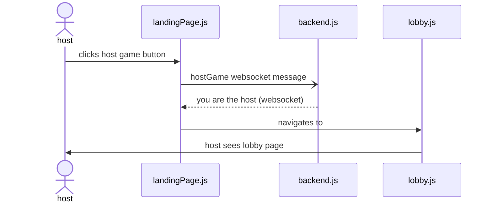
Sequence Diagram 1

The player setting up the game navigates to the website. Upon arrival, they see a large "Host Game" Button. This triggers the creation of a lobby with a room code that the host can share to the other players.

The host navigates to the website, and they click the large "host game" button. This triggers landingPage.js to send a message to the backend notifying that the host has hosted a game. This returns a websocket message back to the landingPage that relays stores a isHost boolean on the host's LandingPage. Then the landingPage immediately navigates to lobby.js, bringing with it information including the isHost boolean. Then thes host can see the lobby page with the necessary host componenets.

Triggering Event:
Host navigates to the game website and clicks a button "Host Game".

#2 **Host gets room code**  

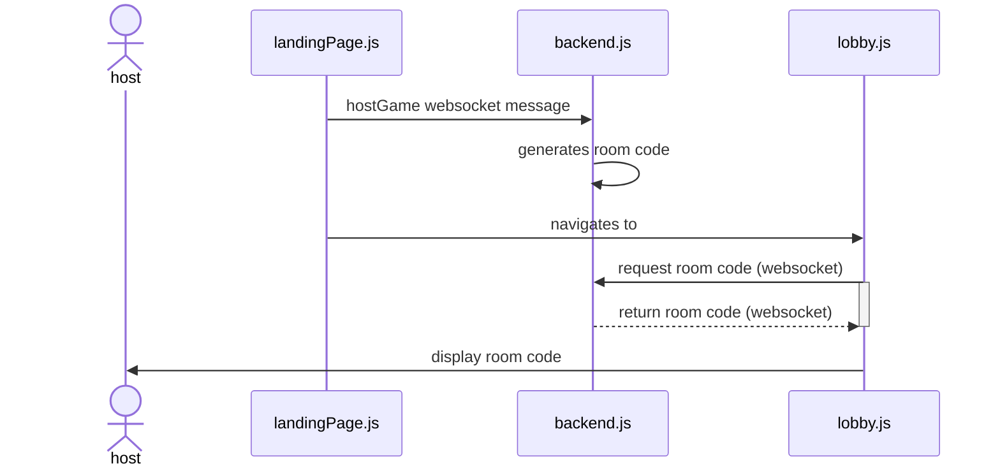
Sequence Diagram 2

The host is presented with a short room code that they will tell the players so they can enter it and join.

Triggering Event: The host has created a lobby by pressing "Host Game".


#3 **Host presses start game button**  

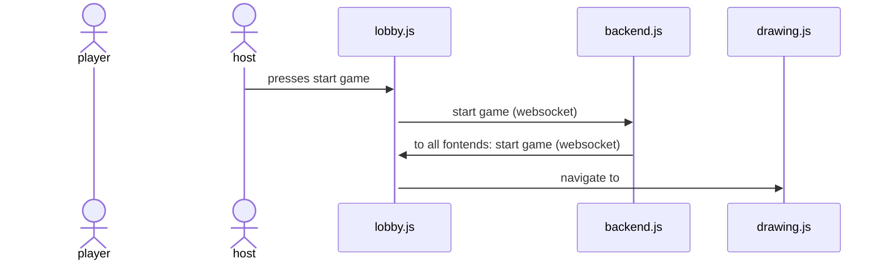
Sequence Diagram 3: one diagram showing the possibility of drawing.
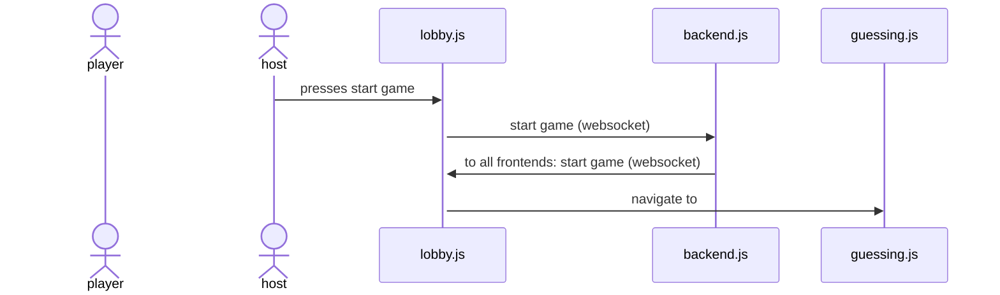
Sequence Diagram 4: alternative diagram showing the possibility of guessing.

Once everyone has joined, the host will choose to press the "start game button". This will send a websocket message to the backend, which will be echoed back to all frontends. Then all frontends will navigate to either drawing.js or guessing.js depending on their role for the first round.

Triggering Event: All players have joined the lobby, and the host wants to start the game.

#4 **Players enter room code**  

Sequence Diagram 5

Players use the room code provided by the host to enter it and join the lobby. Once entered, the landingPage.js sends the code to the backend for verification, and returns whether it's a valid code or not. If it is valid, it will navigate the user to the appropriate lobby, lobby.js. Then the user will see the lobby screen. 

Triggering Event: The host receives the room code and shares it with other players.

#5 **Players select avatar**  

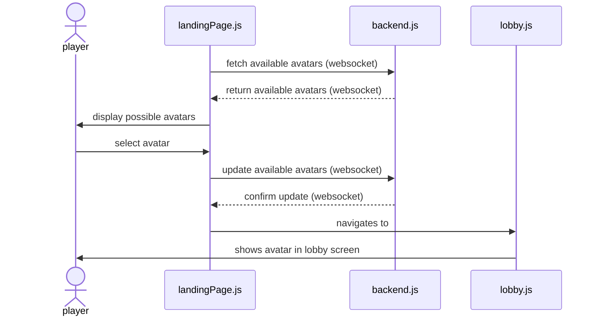
Sequence Diagram 6

Upon joining, each player will be presented with an array of avatars to choose from, and they must tap an avatar to join the lobby with that avatar. First, the frontend must fetch the available avatars from the backend as a websocket message. The backend returns the available avatars, and the landingPage displays them to the user for selection. The user will make a selection, and landingPage.js will update the avatar list in the backend, which will verify with a return value. Then the landingPage.js will navigate to lobby.js where the user will see the lobby along with their avatar.

Triggering Event: A user has entered a valid room code.

#6 **One player is selected at random to be a drawer**  

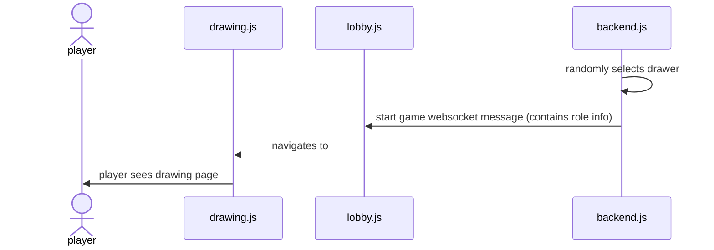
Sequence Diagram 7: showing the possibility of drawing first.
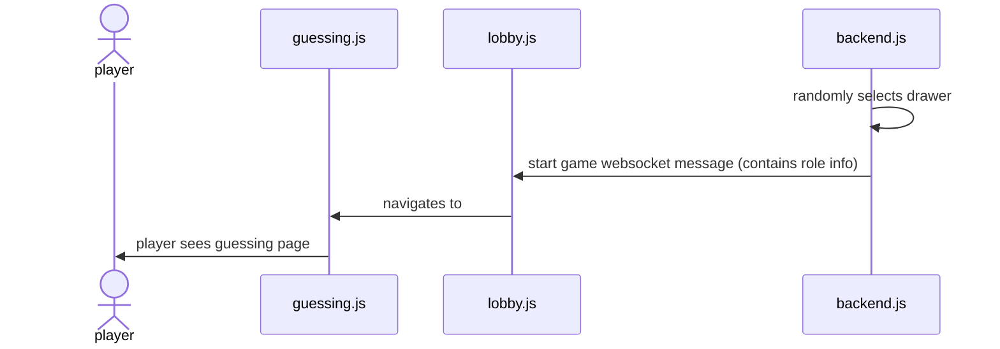
Sequence Diagram 8: alternative showing the possibility of guessing first.

Out of all players, including the host, one is randomly selected to be the first drawer. They will be shown the drawing interface. First, the backend randomly select a drawer from the list of players. Next, it will send a start game websocket message containing role info. Each player's lobby.js will take that information and either navigate them to guessing.js or drawing.js, where the users will see the appropriate UI.

Triggering Event: The host pressed start game.

#7 **The drawer is given 3 random choices to choose from to draw**  

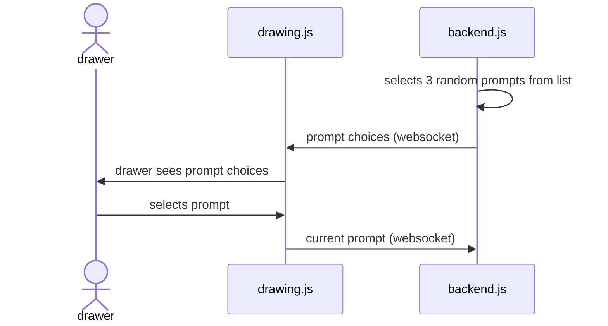
Sequence Diagram 9

The drawer is provided with 3 random prompts on their screen as buttons to choose from to draw. They tap on the choice that they want, and then they can begin drawing. First, the backend must randomly select 3 prompts from the list of possible prompts. The backend relays these choices in a websocket message to the drawing.js frontend file. the drawer sees the list, makes a choice, and drawing.js relays the choice to the backend.

Triggering Event: The drawer has been randomly selected.

#8 **Guessers see a guessing interface and drawing as it progresses**  


Sequence Diagram 10

Default flow: The guessers spectate the drawing and make guesses using the AAC tablet as the round progresses.  
Alternative flow: The guessers spectate the drawing and make guesses using the keyboard after clicking the keyboard toggle button.  
There is a timer counting down during each drawing phase. 

Further explanation: First, the drawer begins drawing on the interface on drawing.js, and frequent websocket information containing drawing data is sent to the backend. The drawing data is echoed to all guessing.js frontends that are spectating. Guessers spectate and enter guesses, which are relayed from guessing.js to backend.js to be checked. The user sees the result of their guess when another websocket message comes back from the backend to guessing.js.

Triggering Event: The drawer has selected one of the three random drawing prompts.  
Alternate Triggering Event: The drawer ran out of time (15s) to choose a prompt and one has been randomly selected.

#9 **Phase ends when the timer expires or everyone has guessed correctly**  


Sequence Diagram 11

At this point, the correct answer will be displayed, and players will be awarded points. Point award values have not been determined yet. First, the backend messages all guessing frontends and the drawing frontend that the drawing is over along with important information about the round. Then the prompt is revealed to the guessers, and the drawer sees the results of who guessed correctly.  

Triggering Event: drawer draws prompt and players try to guess the drawing prompt.

#10 **Players are awarded points for guessing correctly, drawer is awarded for players guessing the drawing** 
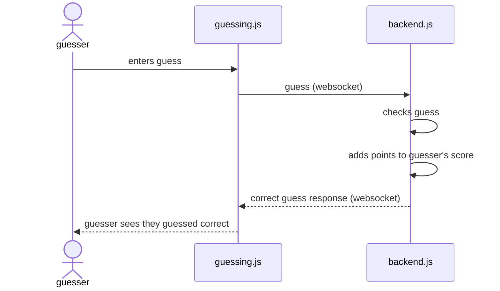
Sequence Diagram 12  

Players will accumulate points based on their performance in the game. When a guesser enters a guess, guessing.js sends the guess in a websocket to the backend where it is checked, points are added to the players score, and the guess response data is sent back to guessing.js for the user to see.

Triggering event: The drawer has begun drawing and one of the guessers wants to make a guess.

#11 **Users see summary screen**  
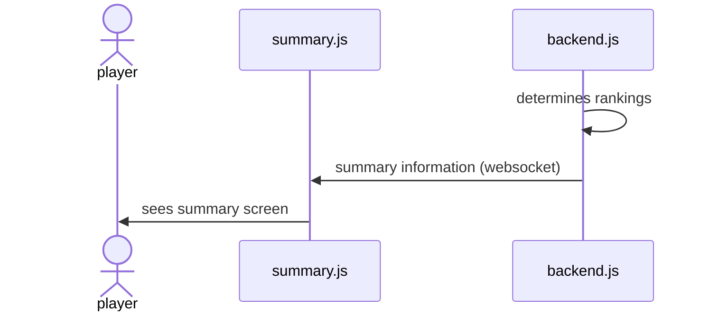
Sequence Diagram 13  

After everyone draws for their third time, total points will be displayed, and rankings will be shown at the end of the game. The backend will keep track of when the final round ends, and it will determine the rankings and deliver  the summary information to summary.js where users will see a summary screen.  

Triggering Event: All players have drawn three times.

## Algorithms

### 1. Player Selection (Random Drawer)
- Selects one player randomly from the active lobby.
- Uses `Math.random()` to pick an index from the player list.

### 2. Word Selection (Random Prompt Assignment)
- Retrieves three random words from a predefined list.
- Uses Fisher-Yates shuffle or a similar algorithm.
- If no selection in 15s, a word is randomly assigned.

### 3. Guess Matching Algorithm
- Converts guess and answer to lowercase, removes punctuation.
- Awards correct answer points 

### 4. Score Calculation
- Guessers earn points based on time taken.
- Drawer earns points based on correct guesses.
- Balanced scoring to avoid excessive competitiveness.
  

### Collection Schemas
**Users Collection**  
```json
{
  "avatar": "String",
  "room_code": "String"
}
```

#### Collection Schemas
**Guess**  
```json
{
  "guess": "String",
}
```
