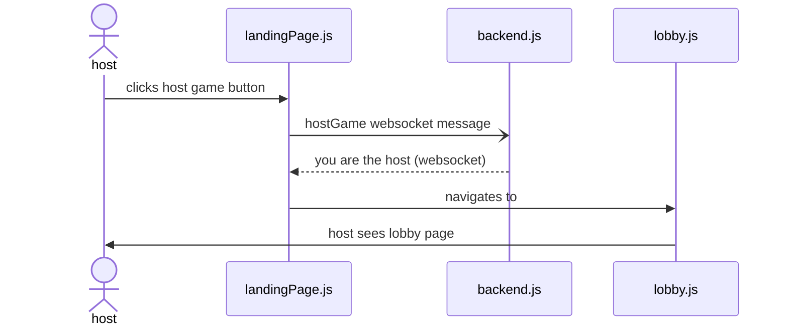
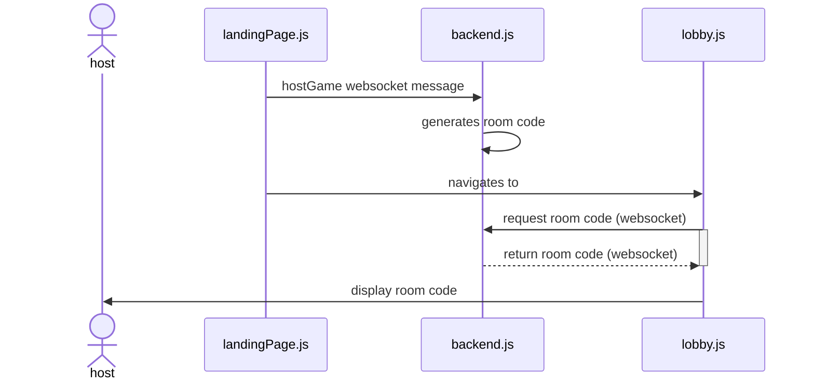
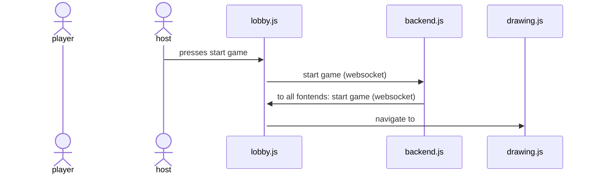
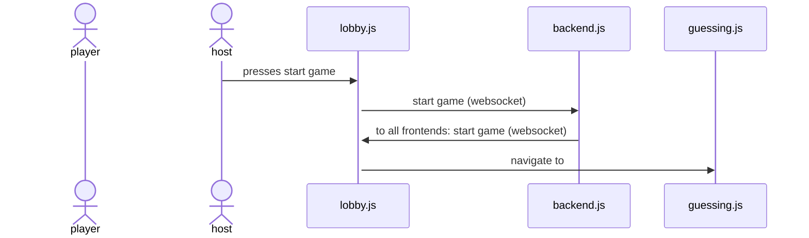
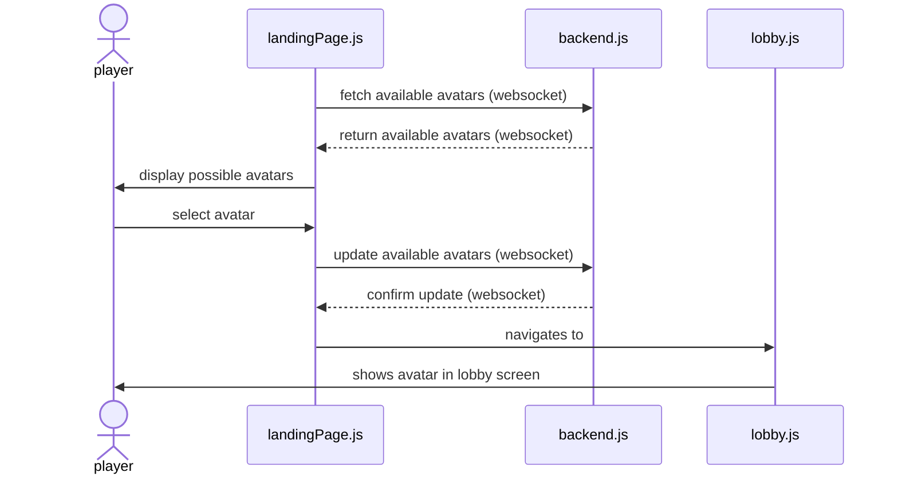
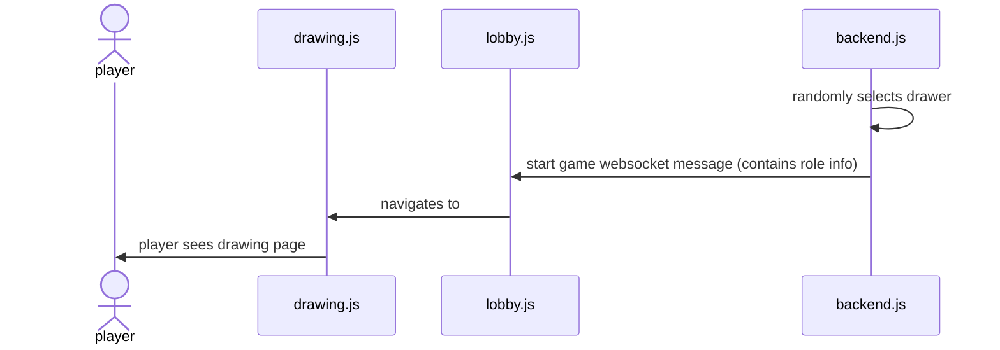
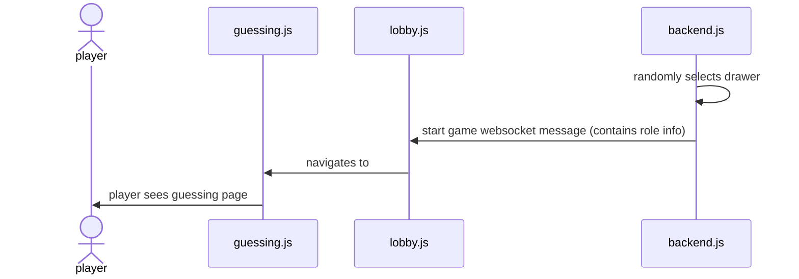
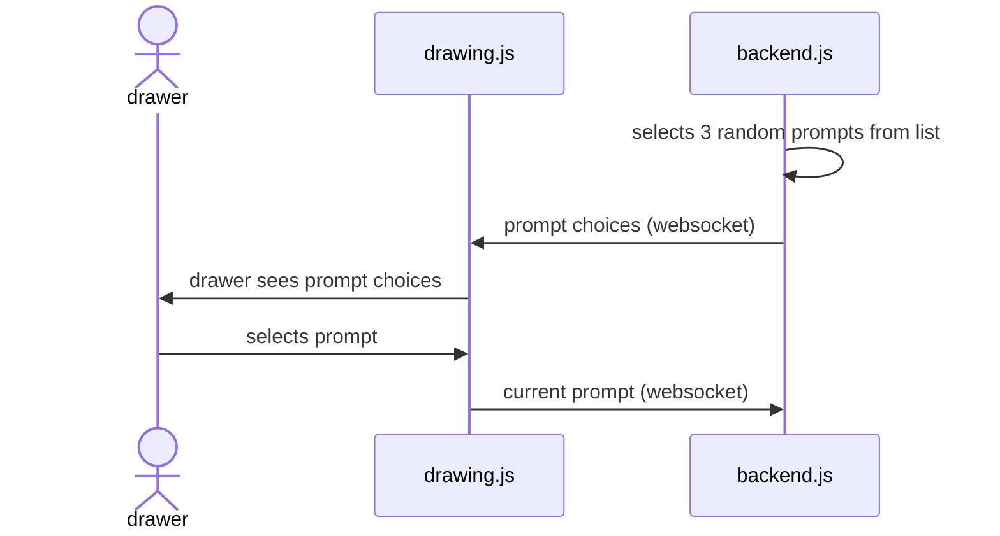
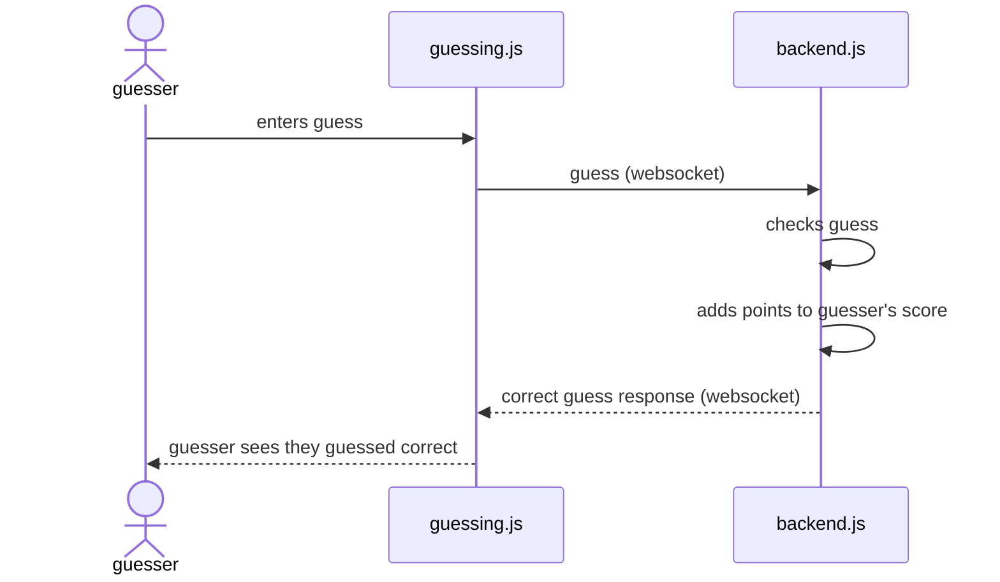
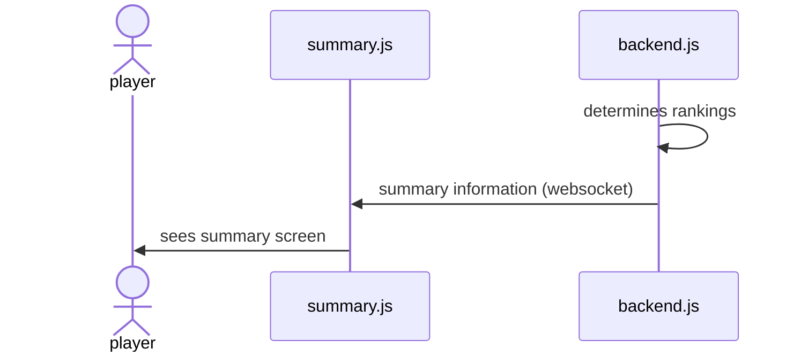

## Component Descriptions

### Frontend (Client-Side):

**GameRoom**  
The GameRoom class contains elements that pertain to management of game sessions, including players, game rounds, and prompt information. It is the core game logic and controls the flow of the game such as which players are drawing, which players are guessing, the transitions between rounds, and starting and ending the game. It will handle prompts ensuring that none are repeated, and provides references to images pertaining to the prompts. This class also handles server-side functionality but for organization it is under client-side.

**Player**  
This class is used to represent individual users who will be playing the game. It will store a player’s details and score pertaining to the game session, and 

**DrawingCanvas**  
This class handles drawing functionality such as the canvas to draw on, the tools to draw with, and the stroke/color to draw with. It gathers the data from the drawer so it can be sent to the interfaces of the other players. 

**ReferenceImageProvider**  
When a prompt is displayed to a drawer, it will be accompanied by a reference image to assist the drawer if they have limited knowledge of the prompt to draw. This class will aid in storing and presenting the image to the current drawer and only to the current drawer. There will be multiple reference images per prompt to discourage the same drawing being done each time. 

**GuessMessage**  
The symbols to be sent in chat are handled by this class. It is used to broadcast AAC symbols a player selects to other player interfaces and also to determine the correct guess for a prompt.

**GameSettings**  
This class is used to provide game sessions with rules and configurations such as how much time per round, how many players can join, and if AAC controls are enabled or not.

**AACBoard**  
This class manages AAC board integration. We will be creating our own AAC Board and store symbols in this class to be referenced all througout the project. 

**AACSymbol**  
This class is used to represent symbols to include in our AAC Board with information such as an ID, a label, category, and image. 

### Backend (Server-Side):

**GameSession**  
This class uses the attributes from the GameRoom class and starts the game. GameSession handles the functionality of game session initiation, progression, and termination. It keeps track of current players in session, rounds completed, and then determines the winning player at the end. 

**DataDrawing**  
This class is fed by the GameSession class and records the data from drawings made by an individual user.

**StrokeData**  
The class is used to represent an individual stroke of a drawing, and stores the coordinates, color, and size.

**SocketHandler**  
This class manages WebSocket integration so that players can interact in real-time. It will handle client-server communication such ad connections, disconnections, drawing and chat events, and round starting or stopping.

## Class Diagram


## Sequence Diagrams

#1 **Host hosts game**  


Sequence Diagram 1

The player setting up the game navigates to the website. Upon arrival, they see a large "Host Game" Button. This triggers the creation of a lobby with a room code that the host can share to the other players.

The host navigates to the website, and they click the large "host game" button. This triggers landingPage.js to send a message to the backend notifying that the host has hosted a game. This returns a websocket message back to the landingPage that relays stores a isHost boolean on the host's LandingPage. Then the landingPage immediately navigates to lobby.js, bringing with it information including the isHost boolean. Then thes host can see the lobby page with the necessary host componenets.

Triggering Event:
Host navigates to the game website and clicks a button "Host Game".

#2 **Host gets room code**  


Sequence Diagram 2

The host is presented with a short room code that they will tell the players so they can enter it and join.

Triggering Event: The host has created a lobby by pressing "Host Game".


#3 **Host presses start game button**  


Sequence Diagram 3: one diagram showing the possibility of drawing.

Sequence Diagram 4: alternative diagram showing the possibility of guessing.

Once everyone has joined, the host will choose to press the "start game button". This will send a websocket message to the backend, which will be echoed back to all frontends. Then all frontends will navigate to either drawing.js or guessing.js depending on their role for the first round.

Triggering Event: All players have joined the lobby, and the host wants to start the game.

#4 **Players enter room code**  

Sequence Diagram 5

Players use the room code provided by the host to enter it and join the lobby. Once entered, the landingPage.js sends the code to the backend for verification, and returns whether it's a valid code or not. If it is valid, it will navigate the user to the appropriate lobby, lobby.js. Then the user will see the lobby screen. 

Triggering Event: The host receives the room code and shares it with other players.

#5 **Players select avatar**  


Sequence Diagram 6

Upon joining, each player will be presented with an array of avatars to choose from, and they must tap an avatar to join the lobby with that avatar. First, the frontend must fetch the available avatars from the backend as a websocket message. The backend returns the available avatars, and the landingPage displays them to the user for selection. The user will make a selection, and landingPage.js will update the avatar list in the backend, which will verify with a return value. Then the landingPage.js will navigate to lobby.js where the user will see the lobby along with their avatar.

Triggering Event: A user has entered a valid room code.

#6 **One player is selected at random to be a drawer**  


Sequence Diagram 7: showing the possibility of drawing first.

Sequence Diagram 8: alternative showing the possibility of guessing first.

Out of all players, including the host, one is randomly selected to be the first drawer. They will be shown the drawing interface. First, the backend randomly select a drawer from the list of players. Next, it will send a start game websocket message containing role info. Each player's lobby.js will take that information and either navigate them to guessing.js or drawing.js, where the users will see the appropriate UI.

Triggering Event: The host pressed start game.

#7 **The drawer is given 3 random choices to choose from to draw**  


Sequence Diagram 9

The drawer is provided with 3 random prompts on their screen as buttons to choose from to draw. They tap on the choice that they want, and then they can begin drawing. First, the backend must randomly select 3 prompts from the list of possible prompts. The backend relays these choices in a websocket message to the drawing.js frontend file. the drawer sees the list, makes a choice, and drawing.js relays the choice to the backend.

Triggering Event: The drawer has been randomly selected.

#8 **Guessers see a guessing interface and drawing as it progresses**  


Sequence Diagram 10

Default flow: The guessers spectate the drawing and make guesses using the AAC tablet as the round progresses.  
Alternative flow: The guessers spectate the drawing and make guesses using the keyboard after clicking the keyboard toggle button.  
There is a timer counting down during each drawing phase. 

Further explanation: First, the drawer begins drawing on the interface on drawing.js, and frequent websocket information containing drawing data is sent to the backend. The drawing data is echoed to all guessing.js frontends that are spectating. Guessers spectate and enter guesses, which are relayed from guessing.js to backend.js to be checked. The user sees the result of their guess when another websocket message comes back from the backend to guessing.js.

Triggering Event: The drawer has selected one of the three random drawing prompts.  
Alternate Triggering Event: The drawer ran out of time (15s) to choose a prompt and one has been randomly selected.

#9 **Phase ends when the timer expires or everyone has guessed correctly**  


Sequence Diagram 11

At this point, the correct answer will be displayed, and players will be awarded points. Point award values have not been determined yet. First, the backend messages all guessing frontends and the drawing frontend that the drawing is over along with important information about the round. Then the prompt is revealed to the guessers, and the drawer sees the results of who guessed correctly.  

Triggering Event: drawer draws prompt and players try to guess the drawing prompt.

#10 **Players are awarded points for guessing correctly, drawer is awarded for players guessing the drawing** 

Sequence Diagram 12  

Players will accumulate points based on their performance in the game. When a guesser enters a guess, guessing.js sends the guess in a websocket to the backend where it is checked, points are added to the players score, and the guess response data is sent back to guessing.js for the user to see.

Triggering event: The drawer has begun drawing and one of the guessers wants to make a guess.

#11 **Users see summary screen**  

Sequence Diagram 13  

After everyone draws for their third time, total points will be displayed, and rankings will be shown at the end of the game. The backend will keep track of when the final round ends, and it will determine the rankings and deliver  the summary information to summary.js where users will see a summary screen.  

Triggering Event: All players have drawn three times.

## Algorithms

### 1. Player Selection (Random Drawer)
- Selects one player randomly from the active lobby.
- Uses `Math.random()` to pick an index from the player list.

### 2. Word Selection (Random Prompt Assignment)
- Retrieves three random words from a predefined list.
- Uses Fisher-Yates shuffle or a similar algorithm.
- If no selection in 15s, a word is randomly assigned.

### 3. Guess Matching Algorithm
- Converts guess and answer to lowercase, removes punctuation.
- Awards correct answer points 

### 4. Score Calculation
- Guessers earn points based on time taken.
- Drawer earns points based on correct guesses.
- Balanced scoring to avoid excessive competitiveness.
  

### Collection Schemas
**Users Collection**  
```json
{
  "avatar": "String",
  "room_code": "String"
}
```

#### Collection Schemas
**Guess**  
```json
{
  "guess": "String",
}
```

